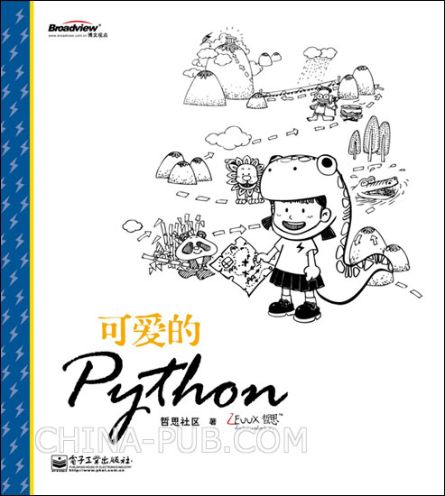
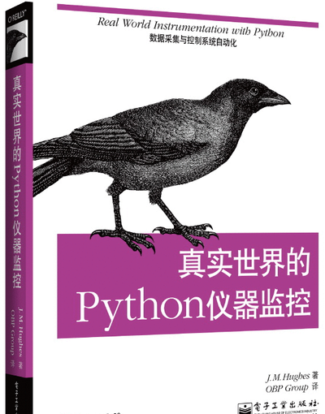
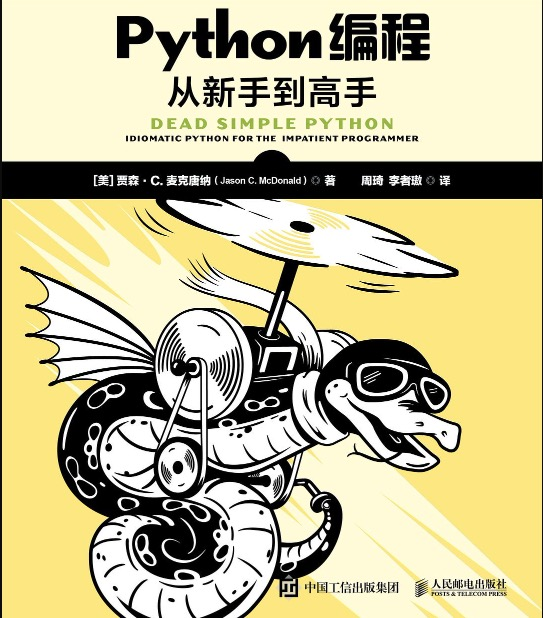
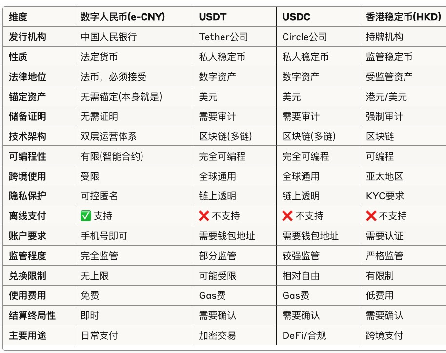
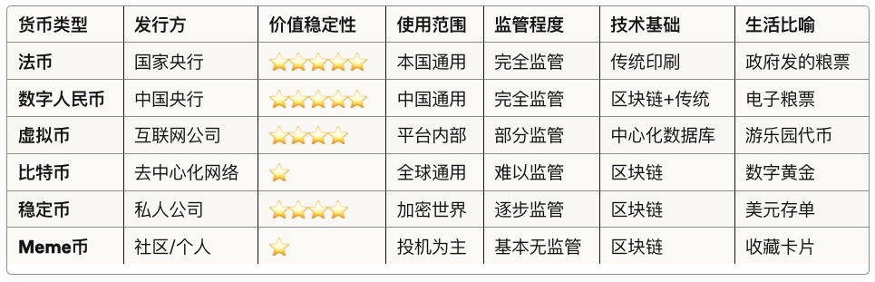
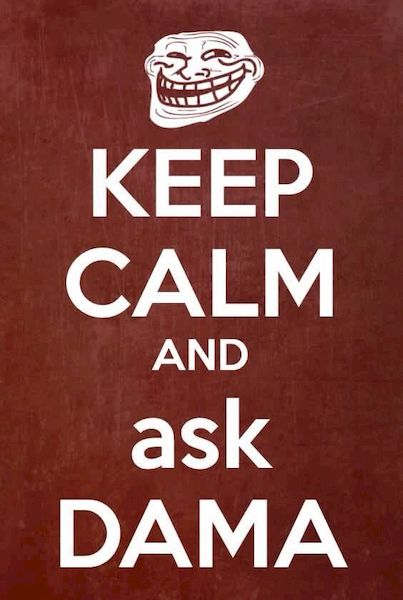
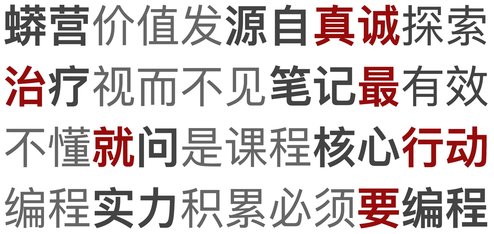
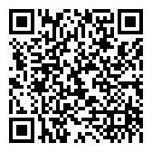

% 未来货币
% 虚拟/加密/..货币漫谈
% FMHub|大妈的多重宇宙

# 但行

## FMHub
> Future Maker Hub 

> - 未来构建者中继站
> - 大小湾终身幼儿园
> - 寻时空未来社会学

## 大妈
> Zoom.Quiet

> - 50+ 年岁
> - 25+ 工作
> - 3+ 冇单位
> - 3500+ [@大妈的多重宇宙](https://www.youtube.com/@Chaos42DAMA)
> - ...

# 好事

## 开发
> 本分

> - 3D 动画
> - 职业顿悟

## 管理
> 过程改进

用**技术**改善**技术人**生活品质

## 写作
> 爱好

> - [22CC](https://www.youtube.com/playlist?list=PLbUdpHqxsZwF4z9kBEy8CD8MPu-kypA_6)
>    - 22世纪学院
>    - 35年前的 Sci-Fi 小说


------




------




------

[](https://book.douban.com/subject/37454087/)


-------


## 社区
> GNU 感召

> - 进入
> - 服务
> - 理解
> - 发起
> - 策划
> - etc.

## 社群
> 社区群落 ~> 领域流量

- 被关联
- 场景向
- 自运营

## 自怼
> DebugUself

```

        re-try -> MVP ---+  
         ^               |    
         |         o    upgrade
         +- o-o o--+-o   |   |
             X   O |   <-+   |
              `   o+         V
   +------|  O| O   /O <-+ heart   
   |          o----o         ^
  truly                      |
   |    +-> DebugUself     inside
   |    |      ^ ^  ^        |
   +> demise   | |  +- self -+
        |      | |      |
        |      | You <--+
        +---> bug  |
               ^   |
               |  made
               +---+  

```

------


## 分享
> 有好东西一定给小朋友们分享

# 莫问

## 正确理解web3
> 普通人

- 如何理解 货币
- 如何理解 货币 和互联网的关系?
- 如何良构 货币 和人类的未来?

## BTC传奇
[比特币与Web3市值演变史](https://claude.ai/public/artifacts/31fc6dcb-f171-43eb-945e-4a5c064b3447)


> - 15年增长 1.37亿倍
> - 2010年：$0.0009（首次定价）
>    - 100522 1万BTC 两个披萨 ~＝$41
> - 2013年：突破$1,000
> - 2025年：突破$123,000
>    - 当年的两个披萨~＝$11亿

## 货币
> 黄金天生不是货币,但, 货币天生是黄金

> - 为了货物交易而创造的钱币
> - 币的原型 -> 贝
> - 金银可分割,更稀有,更耐久

## 货币核心职能
> - 交易媒介
> - 财富存储
> - 价值尺度
>    - 奥地利学派:没有任何货币，包括加密货币，能够完全克服“价值尺度”在本质上的局限性。

## 奥地利学派
```
奥地利学派经济学（Austrian School of Economics）是19世纪末和20世纪初在奥地利发展起来的一种经济学流派。它强调个体行动、主观价值理论和市场过程的动态性。该学派的代表人物包括卡尔·门格尔、路德维希·冯·米塞斯和弗里德里希·哈耶克等。
```
> - 通货膨胀是隐形的抢劫
> - 权力集中必然导致腐败

## BTC的意义
> - 回归"数字黄金"概念
> - 总量有限（2100万个）
> - 去中心化发行

## 在中国谈论的边界
> 基于现行法律

> - ✅ 学习/讨论区块链技术/应用/开发
> - 🟡 持有, 参与海外交易, 投资相关项目
> - ❌ 组织ICO, 开设交易所, 用以非法活动:传销/诈骗/...

## 记住
> 就像

> - 个人可以收藏邮票
> - 但是, 不得基于邮票开设邮票交易所/银行/..

## 现行货币体系
> 水库系统

> - 🏛️ 央行: 水库管理员
>    + 放多少水(印多少钱)
>    + 调节水压(利率)
> - 🏦银行: 分水渠道
>    + 放水/收水(存贷款)
>    + 调节水流(存贷款利率)
> - 💰 货币政策：开闸放水或关闸蓄水
>    + 经济过热→关闸（加息）
>    + 经济萧条→放水（降息）

## 现行体制问题
> - 权力过于集中：管理员权力太大
> - 容易出错：放太多水（通货膨胀）或关太紧（经济萧条）
> - 透明度低：用户无法看到管理员的操作

## 互联网简史
> - Web1.0（1990s）："看报纸时代"
> - Web2.0（2000s）："社交媒体时代"
> - Web3.0（2020s）："区块链/数字产权时代"
> - Web4.0（2040s）："智能化时代"
> - Web5.0（2090s）："情感化时代"
> - Web6.0（2120s）："元宇宙时代"
> - Web7.0（2180s）："全息化时代"
> - Web8.0（2220s）："量子化时代"
> - Web9.0（2420s）："超智能时代"
> - Web10.0（3020s）："宇宙化时代"

## 为什么需要虚拟货币
> - 游戏时代: 游戏内交易 ~ Q币
> - 电商时代: 网上支付 ~ 支付宝/微信支付
> - 全球化时代: 跨境支付 ~ BTC/USDT
> - Web3时代: 数字资产 ~ 数字货币/稳定币
> - 未来: 数字身份 ~ 数字身份认证/数字身份钱包

## web3思想
> 去中心化

> - Web1: 只能看, 看别人房子里的事儿
> - Web2: 能互动, 但平台控制, 租房子
> - Web3: 自己当家, 住自己的房子

## 区块链原理
> 中本聪, Bitcoin, 08年10月31日:白皮书

> - 📔 账本公开：每个人都能看到所有交易记录
> - 🔐 账本防伪：一旦写上，就改不了
> - 🔗 链接账本：每个记账本都连在一起，形成一条链
> - 🛡️ 防止欺诈：通过密码学技术，确保交易安全
> - 🔄 去中心化：没有单一控制者，人人平等参与
> - 🏗️ 建立信任：不需要信任银行或政府
> - 🕵️‍♂️ 匿名性：交易可以是匿名的，保护隐私

## web3现行结构
> - L0级:地基: 网络基础设施
> - L1级:主体: 基础区块链: BTC/ETH/..
> - L2级:装修: 扩容方案: 侧链/状态通道/Plasma
> - L3级:家具: 应用层: DeFi/DApps/..
> - L4级:水电: 生态系统: 开发者社区/工具/服务

## 💵法币
> RMB/USD/EUR/..

> - 由政府发行
> - 受政府信用背书
> - 受政府监管
> - 受政府法律保护
> - 受政府货币政策影响
> - 比喻：政府发的"菜票"

## 🪙 虚拟币
> ..Q币、游戏币

>- 由相关公司发行
>- 受相关公司信用背书
>- 受相关公司监管
>- 只能在特定场景用
>- **不得**与法币自由兑换
>- 比喻：游戏公司发的"菜票"

## ₿ 加密货币
> BTC/ETH/SOL/...

> - 由社区共识决定
> - 受社区信用背书
> - 受社区监管
> - 受社区规约保护
> - 受市场交易活动影响影响
> - 比喻：社区发的"菜票"

## 🐸 Meme币
> 迷因币: 狗狗币/..

> - 加密币的一种
> - 本质：同质化代币（Fungible Token）
> - 比喻：收藏卡片
> - 特点：因为好玩而流行
> - 风险：价格全靠炒作

## NFT
> 本质：Non-Fungible Token（独一无二的代币）

> - 🖼️ 不可互换：每个都独特，像艺术品原作
> - 🎨 数字艺术：可以是图片、视频、音乐等
> - 📜 证明所有权：区块链记录，确保唯一性和真实性
> - 🔒 不可分割：不能买0.5个蒙娜丽莎
> - 📜 智能合约：自动执行的所有权转移
> - 💰 价值波动：价格由市场供需决定

## 代币:Token
> 最本质的含义：数字凭证

> - 🎢 传统游乐园（Web2世界）
>    - 用100元买了10个代币
>    - 只能在这个游乐园用
>    - 代币记录在老板的账本上
> - 🎮 区块链游乐园（Web3世界）
>    - 用100元买了10个Token
>    - Token = 可编程的数字凭证
>    - 规则写在智能合约里，谁都改不了
>    - Token记录在所有人的账本上

## Token
> ..可以代表任何东西

> - 技术层面：数据记录
> - 经济层面：价值载体
> - 社会层面：信任机制/协作工具

## vs传统凭证
| 对比项 | 传统凭证 | Token |
|---------|---------|--------|
| 股票  | 证券公司保管  | 自己钱包保管 |
| 房产证  | 政府发，政府认  | 代码发，全网认 |
| 积分  | 商家说了算  | 智能合约说了算 |
| 票据  | 可以伪造  | 不可伪造 |
| 货币  | 央行印  | 算法发 |

## 记帐方法
> 匹配经济发展

> - 单式记账, 流水帐
> - 复式记账, "有借必有贷，借贷必相等"
> - 分布式记账, 公共帐本, 点对点

## Token超能力
> 可编程...


```
如果（持有超过30天）{
    奖励额外10%
}
如果（转让给朋友）{
    双方都得5%奖励  
}
如果（用于投票）{
    获得治理奖励
}
```

## Token体系
```
Token宇宙
├── 按同质性分
│   ├── FT（同质化）：像人民币，每个都一样
│   └── NFT（非同质化）：像身份证，每个都不同
│
├── 按功能分
│   ├── 货币型：用来买东西（BTC）
│   ├── 功能型：用来用服务（FIL存储）
│   ├── 治理型：用来投票（UNI）
│   ├── 证券型：代表股份（STO）
│   └── ...
└── 按层级分
    ├── L1 Token：主链原生币（ETH）
    ├── L2 Token：二层网络币（MATIC）
    └── 应用Token：DApp代币（AAVE）
```

## Token案例
> ..星巴克积分Token化

> - 传统积分：只能换咖啡, 不能转让, 中心化管理
> -Token化后：
>     - 可以换咖啡
>     - 可以卖给别人
>     - 可以抵押借款
>     - 透明公开

## 链上vs链下
> 上链也就是加密化/Token化

>- 按链式数据结构打包为"区块"
>- 共识算法驱动验证交易
>- 数据广播到所有节点,并顺序连接成"区块链"

## 理解Token
> 关键概念..

> - 🔑 1. 钱包（Wallet）
> - 📜 2. 智能合约（Smart Contract）
> - 🔗 3. 区块链（Blockchain
> - ⛽ 4. Gas费（手续费）

## 💱 稳定币
> USDT/USDC/DAI/...

> - 由公司发行
> - 受锚定法币支持（通常1:1锚定）
> - 接受相关公司监管
> - 接受相关法律监管
> - 受法币汇率影响
> - 比喻：公司发的"菜票",主要用以交易,不是支付

## 🏦 数字人民币（CBDC）



## 综合起来


# 前程

## 趋势
> 🚀 未来展望

> - 机构化：传统金融进场
> - 合规化：监管框架完善
> - 应用化：实际场景落地
> - 跨链化：互操作性增强
> - 智能化：AI与区块链结合

## 新赛道
> - RWA：现实资产代币化
> - DAO：去中心化自治组织
> - DePin：去中心化物理基础设施
> - DeFi：去中心化金融创新
> - SocialFi：社交金融
> - ..

## 最新进展
> - 🇭🇰 香港稳定币法案（2025年5月通过）
> - 🇺🇸 美国GENIUS法案（2025年6月参议院通过）
> - 🌍 其他国家CBDC/稳定币进展
>     - 欧盟：数字欧元 2028年上线
>     - 日本：数字日元 概念阶段
>     - 新加坡：监管框架 2025年实施
>     - 英国：数字英镑 2025年决定是否

## 风险对比

| 类型 | 风险等级 | 主要风险 |
|------|---------|---------|
| **数字人民币** | ⭐ (极低) | 隐私风险、政策风险 |
| **USDT** | ⭐⭐⭐⭐ (高) | 储备风险、监管风险、挤兑风险 |
| **USDC** | ⭐⭐⭐ (中) | 银行风险、监管风险、冻结风险 |
| **香港稳定币** | ⭐⭐ (低) | 监管风险、市场风险 |
| **美国GENIUS稳定币** | ⭐⭐ (低) | 政策风险、合规成本 |

## 防骗
> 秘诀：天上不会掉馅饼

## PS:
> 推荐读物

> - [一文说清“链上”和“链下” — FISCO BCOS 3\.0 v3\.11\.0 文档](https://fisco-bcos-doc.readthedocs.io/zh-cn/latest/docs/articles/1_conception/on_and_off_the_blockchain.html)
> - 《比特币：一种点对点的电子现金系统》- 中本聪白皮书
> - [货币的非国家化 (哈耶克)](https://book.douban.com/subject/2155342/)
> - [区块链——领导干部读本（修订版）](https://book.douban.com/subject/34896742/)
> - [货币未来：从金本位到区块链](https://book.douban.com/subject/35178904/)

## PPS:
> 有关电影

> - 2016.[寄希望于比特币](https://movie.douban.com/subject/26713749/)
> - 2024 [币电奇缘：比特疑云](https://movie.douban.com/subject/37063965/)
> - 2025 [E202｜对话肖风：在香港稳定币的沸腾时刻，一些回归常识的冷思考 - YouTube](https://www.youtube.com/watch?v=pR78J-hhbM8)

## PPPS:
>- 忘记的必是不重要的
>- 不知道就是不必要的
>- 放弃的是真不上心的
>- 事实往往不是这样的
>- ...保持谦虚

# (￣▽￣)

## 幻灯
> NOT PPT

[slides.zoomquiet.io/web3cryptcoin101](http://slides.zoomquiet.io/web3cryptcoin101.html)

## 是也乎
- 250807 public
- 250804 append.
- 250723 init.


-------



## 开始提问
>- 对货币,你的理解?
>- 对虚拟货币,你的看法?
>- 对加密币的未来你的想象??
>- ...

## Q&A
> ask**DAMA**@**g**oo**g**le**g**roup**s**.com

## Camp
> 比来时好


>- 蟒营价值发源自**真诚**探索
>- **治**疗视而不见笔记**最**有效
>- 不懂**就**问是课程核心**行动**
>- 编程实力积累必须**要**编程


------



## 内省
> 不忘初心...

- 什么是教育?
- 什么是编程?
- [探讨信息化社会中中国传统思想的作用](https://zoomquiet.io/IMHO/19980101-chinese4internet/) 1998 科学哲学


------



[Blogging 蟒营™ 博客](https://blog.101.camp/NC/190711-NC101-self-destruction/)

    blog.101.camp/NC/190711-NC101-self-destruction
    
> askdama@googlegroups.com

## 蟒营®
> 沿革

>- 2008 PythoniCamp 金山大学
>- 2015 蟒营™课程
>- 2017 DebugUself/自怼圈
>- 2018 蟒营®网络课程开源框架
