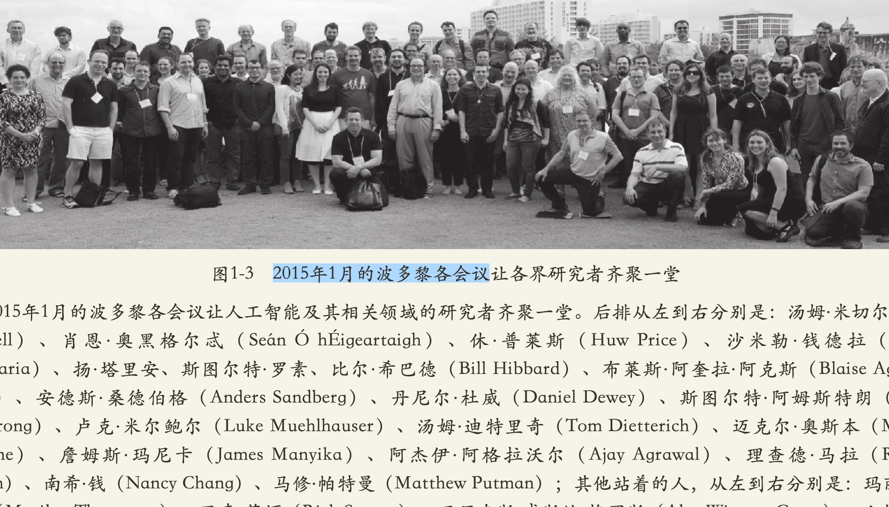
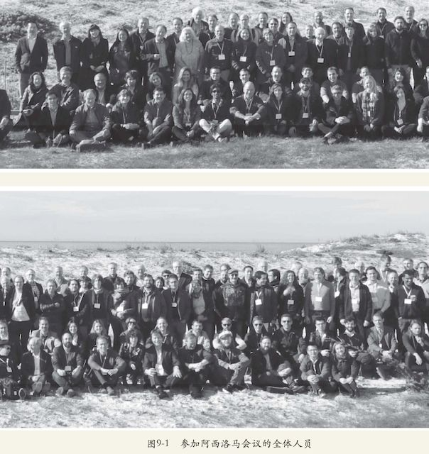

% 未来货币
% 虚拟/加密/..简单理解
% FMHub|大妈的多重宇宙

# 但行

## FMHub
> Future Maker Hub 

> - 未来构建者中继站
> - 大小湾终身幼儿园
> - 寻时空未来社会学

## 大妈
> Zoom.Quiet

> - 50+ 年岁
> - 25+ 工作
> - 4+ 冇单位
> - 3500+ [@大妈的多重宇宙](https://www.youtube.com/@Chaos42DAMA)
> - ...

# 好事

## 开发
> 本分

> - 3D 动画
> - 职业顿悟

## 管理
> 过程改进

用**技术**改善**技术人**生活品质

## 写作
> 爱好

> - [22CC](https://www.youtube.com/playlist?list=PLbUdpHqxsZwF4z9kBEy8CD8MPu-kypA_6)
>    - 35年前的 Sci-Fi 小说

------


------


-------


## 社区
> GNU 感召

> - 进入
> - 服务
> - 理解
> - 发起
> - 策划
> - etc.

## 社群
> 社区群落 ~> 领域流量

- 被关联
- 场景向
- 自运营

## 自怼
> DebugUself

有心无心,自然聚集

```

        re-try -> MVP ---+  
         ^               |    
         |         o    upgrade
         +- o-o o--+-o   |   |
             X   O |   <-+   |
              `   o+         V
   +------|  O| O   /O <-+ heart   
   |          o----o         ^
  truly                      |
   |    +-> DebugUself     inside
   |    |      ^ ^  ^        |
   +> demise   | |  +- self -+
        |      | |      |
        |      | You <--+
        +---> bug  |
               ^   |
               |  made
               +---+  

```

------


## 分享
> 有好东西一定给小朋友们分享

# 莫问

## 正确地关心人类命运
> 普通人

- 如何理解 AI?
- 如何理解 AI 和人的关系?
- 如何良构 AI 和人类的未来?

# 前程

## 开始提问
>- 对未来,你的看法?
>- 对AI,你的看法?
>- 身为一个人类的意义是什么?
>- ...

-------



-------



## 达利奥曰:
> [看待事物的不同方式](https://www.linkedin.com/pulse/how-people-seeing-things-differently-ray-dalio-55lgc/)

>- 以自我为中心
>- 以他人和整体利益为中心

## 架构
> 什么是"Architecture"

>- 所有人认为重要的事
>- 系统中难以改变的事
>- ...

## 伟大成果
> 只能来自伟大的人

>- 如何变得伟大?
>- 如何让人们轻松地做正确的事情?

## AIGCxPower
> 🚀 AI赋能千行百业²⁰²⁵

>- GC: 生成内容
>- G:
>    + **G**enerative 生成式
>    + **G**rowing 生长式
>- **C**ivilization 文明
>- AI**共生文明**联盟

## PS:
[探讨信息化社会中中国传统思想的作用](https://zoomquiet.io/IMHO/19980101-chinese4internet/)

- 1998 科学哲学

## PPS:
> 每位学习者

>- 都值得拥有自己的域名
>- CyberSpace 中私人王国
>- 持续输出...
>    - 直到突破


-------

](img/2023-06-13-zoomquiet.io.png)

## PPPS:
>- 忘记的必是不重要的
>- 不知道就是不必要的
>- 放弃的是真不上心的
>- 事实往往不是这样的
>- ...保持谦虚

# (￣▽￣)

## 幻灯
> NOT PPT

[slides.zoomquiet.io/web3cryptcoin101](http://slides.zoomquiet.io/web3cryptcoin101.html)

## 是也乎
- 250804 append.
- 250723 init.


-------


## Q&A
> ask**DAMA**@**g**oo**g**le**g**roup**s**.com

## 눈_눈
> 是也乎

## Camp
> 比来时好


>- 蟒营价值发源自**真诚**探索
>- **治**疗视而不见笔记**最**有效
>- 不懂**就**问是课程核心**行动**
>- 编程实力积累必须**要**编程


------


## 内省
> 不忘初心...

- 什么是教育?
- 什么是编程?


------


[Blogging 蟒营™ 博客](https://blog.101.camp/NC/190711-NC101-self-destruction/)

    blog.101.camp/NC/190711-NC101-self-destruction
    
> askdama@googlegroups.com

## 蟒营®
> 沿革

>- 2008 PythoniCamp 金山大学
>- 2015 蟒营™课程
>- 2017 DebugUself/自怼圈
>- 2018 蟒营®网络课程开源框架
