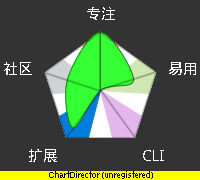

.. include:: <s5defs.txt>

==================================================================
知.时\ :sup:`管理`
==================================================================

～持续的效率进化之旅 (powered by rst2S5)

:Authors: `Zoom.Quiet <zoomquiet+km@gmail.com>`__
:URL:    http://s5.zoomquiet.io/140303-time4km/

.. This document has been placed in the CC domain.
.. _Docutils: http://docutils.sourceforge.net/
.. _reStructuredText: http://docutils.sourceforge.net/rst.html
.. _S5: http://meyerweb.com/eric/tools/s5/
.. _Firefox: http://www.mozilla.com/firefox/

.. _Zoom.Quiet:
    http://code.google.com/p/openbookproject/wiki/ZoomQuiet
.. _(CC)by-nc-sa:
    http://creativecommons.org/licenses/by-nc-sa/2.5/cn/
.. _FireFox:
    http://www.mozilla.com/firefox/
.. _S5介绍:
    http://zoomquiet.org/res/s5/100826-PyTDD/s5.html
.. _WYTIWYG:
    http://wiki.woodpecker.org.cn/moin/WyTiWyG

.. 图片定义区
.. |bullet| unicode:: U+02022
.. |mode| unicode:: U+00D8 .. capital o with stroke

.. |S5icon| image:: pix/S5icon.GIF
    :align: top
    :scale: 100 %
    :target: http://www.meyerweb.com/eric/tools/s5/
.. |LeoProse| image:: pix/LeoProse.gif
    :align: top
    :scale: 100 %
    :target: http://wiki.woodpecker.org.cn/moin/LeoEnvironment
.. |cc-byncsa31| image:: i/icon/cc-byncnd-88x31.png
   :alt: (CC)by-nc-sa 许可证
   :target: http://creativecommons.org/licenses/by-nc-sa/2.5/cn/
.. |cc-byncsa15| image:: i/icon/cc-byncnd-80x15.png
   :alt: (CC)by-nc-sa 许可证
   :target: http://creativecommons.org/licenses/by-nc-sa/2.5/cn/
.. |zqeye| image:: i/id/zoomquiet_1-1_outline.png
   :alt: 是也乎;-)
   :target: http://wiki.woodpecker.org.cn/moin/ZoomQuiet

.. |lr_s5| image:: pix/levelradar_s5.png
    :scale: 100 %

.. footer:: 

   `Zoom.Quiet`_ v13.03.03 |cc-byncsa15| 推荐用 `FireFox`_ 获得最佳游览效果

Randy Pausch
====================================

.. container:: handout

    - `Randy Pausch教授的時間管理演講。 <http://blogs.myoops.org/lucifer.php/2008/10/28/randypauschtime>`_ 
    - 07十二月 維吉尼亞大学
    

.. class:: takahashi7

    有关视频

:查阅:
    http://code.ijinshan.com/res/m/RandyPausch-TimeManagement/

.. container:: notes

   - ...

<免责/>
=========

.. container:: handout

   山寨的，非业界公认的，个人体验为基础!
   |zqeye|

.. class:: takahashi1

    参考所有同好行为总结而得
        - 一切资料来自网络互动挖掘
        - 一切想法来自日常学习工作
        - 一切体悟来自各种沟通交流
        - 一切知识来自社区分享印证
        - 一切经验来自个人失败体验
    

高橋流!
=========

.. container:: handout

   `Takahashi-method 幻灯风格 <http://blog.derjohng.com/2006/04/12/takahashi-method-%E7%B0%A1%E5%A0%B1/>`__ 
   源自 Ruby 创始人高橋征義(Masayoshi Takahashi)

.. class:: center

    .. image:: pix/Takahashi-method.jpg
        :height: 500px
        :alt: 高橋流
        :align: center
        :target: http://blog.derjohng.com/2006/04/12/takahashi-method-%E7%B0%A1%E5%A0%B1/

文字
=========

.. container:: handout

   `Takahashi-method 幻灯风格 <http://blog.derjohng.com/2006/04/12/takahashi-method-%E7%B0%A1%E5%A0%B1/>`__ 
   源自 Ruby 创始人高橋征義(Masayoshi Takahashi)

.. class:: center takahashi9

    巨大

幻灯
=========

.. container:: handout

   `Takahashi-method 幻灯风格 <http://blog.derjohng.com/2006/04/12/takahashi-method-%E7%B0%A1%E5%A0%B1/>`__ 
   源自 Ruby 创始人高橋征義(Masayoshi Takahashi)

.. class:: center takahashi9

    很多

播放
=========

.. container:: handout

   `Takahashi-method 幻灯风格 <http://blog.derjohng.com/2006/04/12/takahashi-method-%E7%B0%A1%E5%A0%B1/>`__ 
   源自 Ruby 创始人高橋征義(Masayoshi Takahashi)

.. class:: center takahashi9

    快!

播放
=========

.. container:: handout

   `Takahashi-method 幻灯风格 <http://blog.derjohng.com/2006/04/12/takahashi-method-%E7%B0%A1%E5%A0%B1/>`__ 
   源自 Ruby 创始人高橋征義(Masayoshi Takahashi)

.. class:: center takahashi8

    很快!

播放
=========

.. container:: handout

   `Takahashi-method 幻灯风格 <http://blog.derjohng.com/2006/04/12/takahashi-method-%E7%B0%A1%E5%A0%B1/>`__ 
   源自 Ruby 创始人高橋征義(Masayoshi Takahashi)

.. class:: center takahashi7

    非常快!

所以:
=========

.. container:: handout

   `Takahashi-method 幻灯风格 <http://blog.derjohng.com/2006/04/12/takahashi-method-%E7%B0%A1%E5%A0%B1/>`__ 
   源自 Ruby 创始人高橋征義(Masayoshi Takahashi)

.. class:: center takahashi10

    :orange:`听`

<brief/>
=========

.. container:: handout

   俺->KM->工具->持续完善 |zqeye|

.. class:: takahashi

    - :orange:`5' 有关ZQ`
    - :silver:`15' 乜是时间?知识?`
    - :silver:`15' 怎么管理这货?`
    - :silver:`15'自由沟通`

.. container:: notes

   - 

<Zoom.Quiet>
==================

.. container:: handout

   |zqeye|

.. class:: takahashi

    .. image:: i/id/100514-zq-eye.png
        :align: center
        :scale: 80 %
        :alt: 是也乎,是也乎

    .. image:: i/map/50ren-ZoomQuiet-s5-v800.png
        :align: center
        :scale: 100 %
        :alt: Zoom.Quiet
        :target: http://zoomquiet.org

.. container:: notes

   - 

有称...
==================

.. container:: handout

   ;-} |zqeye|

.. class:: takahashi8

    周导

.. container:: notes

   - 

其实...
==================

.. container:: handout

   基调是分享交流;-} |zqeye|

.. class:: takahashi8

    `大妈`__

__ http://wiki.woodpecker.org.cn/moin/ZoomQuiet

.. container:: notes

   - 

牛妞
==================

.. container:: handout

   \\ (^o^) / 596d

.. image:: i/foto/niuniu110105.jpeg
    :align: center
    :height: 700px
    :alt: 表情牛妞

.. container:: notes

   - 我的女儿刚刚一岁半,非常牛,,,脾气牛,头脑牛,虽然不会说话,但是已经能指挥我们干活了...
   - 120426-niuniu-表情帝

牛妞
==================

.. container:: handout

   \\ (^o^) / 1096d

.. image:: i/foto/120426-niuniu-表情帝.jpg
    :align: center
    :height: 700px
    :alt: 表情牛妞

.. container:: notes

   - 我的女儿刚刚一岁半,非常牛,,,脾气牛,头脑牛,虽然不会说话,但是已经能指挥我们干活了...
   - 120426-niuniu-表情帝

</Zoom.Quiet>
==================

.. container:: handout

    - 纯种Pythoner，自由软件原教旨主义者 
    - 关注社会化教育及知识管理；喜爱SF和摄影。 
    - 尝试使用Pythonic体验感化国人主动进入自由软件世界体验/学习/再创作

.. class:: takahashi8

   (^.^)

.. container:: notes

   - 

<brief/>
=========

.. container:: handout

   俺->KM->工具->持续完善 |zqeye|

.. class:: takahashi

    - :gray:`5' 有关ZQ`
    - :orange:`15' 乜是时间?知识!`
    - :silver:`15' 怎么管理这货?`
    - :silver:`15'自由沟通`

.. container:: notes

   - 

< init.Time Management>
====================================

.. container:: handout

   只能用生命来实证的时生活状态...  |zqeye|

.. class:: takahashi8

    时间?

.. container:: notes

   - ...

什么是时间？
====================================

.. container:: handout

    从 `1915之后 <http://amuseum.cdstm.cn/AMuseum/time/01gzsj/0106.html>`_ 时间已经失去了原有意义 
    |zqeye|

.. class:: takahashi7

    幻觉!

.. container:: notes

   - ...

什么是时间？
====================================

.. container:: handout

   从我看来...  |zqeye|

.. class:: takahashi8

    :orange:`时` 刻

.. container:: notes

   - ...

什么是时间？
====================================

.. container:: handout

   只是具体可记忆的...  |zqeye|

.. class:: takahashi8

    :orange:`间` 隔

.. container:: notes

   - ...

什么是时间？
====================================

.. container:: handout

   行为而已...  |zqeye|

.. class:: takahashi8

    :orange:`行为`

.. container:: notes

   - ...

<Knowledge>
==================

.. container:: handout

   不是东西... |zqeye|

.. class:: takahashi7

    知识?

.. container:: notes

   - 

掌握过去
==================

.. container:: handout

   了解/理解... |zqeye|

.. class:: takahashi8

    :orange:`知` 晓

.. container:: notes

   - 

识别未知
==================

.. container:: handout

   辨明/分析/规划... |zqeye|

.. class:: takahashi8

    :orange:`识` 别

.. container:: notes

   - 

</Knowledge>
==================

.. container:: handout

   不是东西... |zqeye|

.. class:: takahashi8

    :orange:`心` 态

.. container:: notes

   - 

什么是管理?
====================================

.. container:: handout

   对内外的信息管道和整理控制...  |zqeye|

.. class:: takahashi8

    :orange:`管` 道

.. container:: notes

   - ...

什么是管理?
====================================

.. container:: handout

   对内外的信息管道和整理控制...  |zqeye|

.. class:: takahashi8

    梳 :orange:`理`

.. container:: notes

   - ...

什么是管理?
====================================

.. container:: handout

   进行沟通而已...  |zqeye|

.. class:: takahashi8

    :orange:`对话`

.. container:: notes

   - ...

</init.Time Management>
====================================

.. container:: handout

   心灵和智慧的力量外在表现...  |zqeye|

.. class:: takahashi7

    关乎

    心智

.. container:: notes

   - ...

图书推荐!
====================================

.. container:: handout

   李笑来的真心分享...己再版4次了..  |zqeye|

.. class:: takahashi

    .. image:: i/s3778613-friendtime.jpg
        :align: center
        :height: 700px
        :alt: 李笑来
        :target: http://book.douban.com/subject/3609132

.. container:: notes

   - ...

<KM>
==================

.. container:: handout

   从尊重自个儿掌握的知识开始! |zqeye|

.. class:: takahashi7

    `PKM <http://sociallearnlab.org/wiki/index.php?title=PKM&variant=zh-cn>`__

.. container:: notes

   - 

`SECI模型`__
=======================

__ http://www.12manage.com/methods_nonaka_seci_zh.html

.. container:: handout

   - 知识只有流动才有价值...
   - 野中郁次郎（Ikujiro Nonaka）和竹内弘高（Hirotaka Takeuchi）认为...

.. class:: takahashi7

    .. image:: i/KMsys-Seci20m1.jpg
        :align: center
        :height: 600px
        :alt: ScrapBook
        :target: http://sociallearnlab.org/wiki/index.php?title=PKM&variant=zh-cn

.. container:: notes

   - 

知识之轮
=======================

.. container:: handout

    知识是种动态的流动状态! |zqeye|

.. class:: takahashi7

    .. image:: i/kmtranfer2.gif
        :align: center
        :height: 500px
        :alt: ScrapBook

.. container:: notes

   - 

EKM
=======================

.. container:: handout

    企业知识管理

    # 技术学派: KM是对信息的管理;

    # 行为学派: KM是对人的管理;

    # 综合学派: KM是将信息处理能力和人的创造力结合,增强组织对环境的适应能力; 

.. class:: takahashi7

    .. image:: i/kmzl2.jpg
        :align: center
        :height: 500px
        :alt: ScrapBook

.. container:: notes

   - 

EKM目标
=======================

.. container:: handout

    KM keep growing environment culture |zqeye|
    
    which promoting organization be learnning!

.. class:: takahashi3

::
    
    知识管理乃是
        培育
            可催生
                自学习型组织
        的文化氛围!

.. container:: notes

   - 

</KM>
==================

.. container:: handout

   持续改进才有效果！ |zqeye|

- `提问的智慧 <http://wiki.woodpecker.org.cn/moin/AskForHelp>`__
- `邮件列表的规范和礼节 <http://www.woodpecker.org.cn/share/classes/050730-CPUG/usMaillist/>`__
- `WYTIWYG <http://wiki.woodpecker.org.cn/moin/WyTiWyG>`__
- `Wiki导览 +从入门到享用MoinMoin <http://www.woodpecker.org.cn/share/doc/SKSIG/DriveIntoMoinPub/>`__
- `"假学习"和"真学习" <http://www.zreading.cn/archives/1629.html>`__
- `我也有话要说 <http://www.lixiaolai.com/index.php/archives/9568.html>`__ \ :sup:`笑来系列`\
- `褪墨 <http://www.mifengtd.cn/about>`_  \ :sup:`专注GTD`\
- `如何进行人脉管理 <http://hi.baidu.com/wikicc/blog/item/388012f398f2efca0a46e0ac.html>`__
- ...

.. container:: notes

   - 

<Why Time Management>
====================================

.. container:: handout

   为什么以及怎么...  |zqeye|

.. class:: takahashi8

    不靠谱

.. container:: notes

   - ...

为什么要...
====================================

.. container:: handout

   为嘛这么讲？！  |zqeye|

.. class:: takahashi7

    点解?!

.. container:: notes

   - ...

学生本质
====================================

.. container:: handout

   就职以前的生活状态...  |zqeye|

.. class:: takahashi8

    消费者

.. container:: notes

   - ...

职员本质
====================================

.. container:: handout

   在企業,一切以赢利为目标导向，一切都成本化了...  |zqeye|

.. class:: takahashi8

    销售者

.. container:: notes

   - ...

一切要有个交待
====================================

.. container:: handout

   时间作为沉没成本必须高度经营.....  |zqeye|

.. class:: takahashi8

    回报率

.. container:: notes

   - ...

悲惨工作三征兆!
====================================

.. container:: handout

   `The Three Signs of a Miserable Job <http://www.amazon.cn/dp/enbk612613>`__  |zqeye|

.. class:: takahashi4

    .. class:: incremental

    - 无闻性
    - 不可测
    - 无关性

.. container:: notes

   - ... http://wiki.woodpecker.org.cn/moin/5W1H

对策
====================================

.. container:: handout

   任意时刻,不背黑锅,就得！必须明确的工程元素!在第一时间!  |zqeye|

.. class:: takahashi7

    `5W1H <http://wiki.woodpecker.org.cn/moin/5W1H>`__

.. container:: notes

   - Who/When/Where/Why/What/How

否则!
====================================

.. container:: handout

   你的宿命必须是...  |zqeye|

.. class:: takahashi9

    :red:`烈士`

.. container:: notes

   - ... 

举例来说
====================================

.. container:: handout

    `九段秘书的薪酬排行榜 <http://www.planeboy.net/2010/10/24/how-to-organize-a-successful-meeting.htm/comment-page-1#comment-294>`_
    |zqeye|

.. class:: takahashi9

    开会

.. container:: notes

   - 

600元/月
====================================

.. container:: handout

   一段秘书;作了而已  |zqeye|

.. class:: takahashi7

    发通知

.. container:: notes

   - 邮件了事儿

800元/月
====================================

.. container:: handout

   二段秘书;作了而已  |zqeye|

.. class:: takahashi7

    抓落实

.. container:: notes

   - 电话通知

1000元/月
====================================

.. container:: handout

   三段秘书;作了而已  |zqeye|

.. class:: takahashi7

    重检查

.. container:: notes

   - 合理提醒

1500元/月
====================================

.. container:: handout

   四段秘书;作完  |zqeye|

.. class:: takahashi7

    勤准备

.. container:: notes

   - 电气设备,人员变动

2000元/月
====================================

.. container:: handout

   五段秘书;作对  |zqeye|

.. class:: takahashi7

    细准备

.. container:: notes

   - 个性化资料!

3000元/月
====================================

.. container:: handout

   六段秘书;作对  |zqeye|

.. class:: takahashi7

    做记录

.. container:: notes

   - 理解内容

5000元/月
====================================

.. container:: handout

   七段秘书;作对  |zqeye|

.. class:: takahashi7

    发记录

.. container:: notes

   - 理解职责边界

10000元/月
====================================

.. container:: handout

   八段秘书;作好  |zqeye|

.. class:: takahashi7

    定责任

.. container:: notes

   - 理解能力边界

30000元/月
====================================

.. container:: handout

   九段秘书;令他人作好  |zqeye|

.. class:: takahashi7

    做流程

.. container:: notes

   - 固化经验

工作的层级
====================================

.. container:: handout

   出自 `从员工到总经理的成长笔记：自慢 <http://vip.book.sina.com.cn/book/index_72252.html>`__  |zqeye|

.. class:: takahashi

    .. class:: incremental

    - 做了
    - 做完
    - 做对
    - 做好
    - 帮他人做好!

.. container:: notes

   - ...

管理对象:0
====================================

.. container:: handout

   时间的价值真的不同,,,  |zqeye|

.. class:: takahashi9

    自己

.. container:: notes

   - ...

管理对象:1
====================================

.. container:: handout

   管理领导的时间就是为领导服务,,,  |zqeye|

.. class:: takahashi9

    领导

.. container:: notes

   - ...

管理对象:2
====================================

.. container:: handout

   协调同事的时间,就是协同,,,  |zqeye|

.. class:: takahashi9

    同事

.. container:: notes

   - ...

管理对象:3
====================================

.. container:: handout

   追踪下属的时间,就是团队,,,  |zqeye|

.. class:: takahashi9

    下属

.. container:: notes

   - ...

靠谱
====================================

.. container:: handout

   具体什么是,,...  |zqeye|

.. class:: takahashi

    :orange:`Kaopulity`
    

.. container:: notes

   - ...

点解 Kaopulity
====================================

.. container:: handout

   令一切流程化,并所有人可用!  |zqeye|

.. class:: incremental takahashi

    * :orange:`K` eep
    * :orange:`a` ll
    * :orange:`o` f
    * :orange:`p` rocesses
    * :orange:`u`\ sab\ :orange:`lity`
    

.. container:: notes

   - ...

</Why Time Management>
====================================

.. container:: handout

   心灵和智慧的力量外在表现...  |zqeye|

.. class:: takahashi7

    时间
    
    管理
    

.. container:: notes

   - ...

<brief/>
=========

.. container:: handout

   俺->KM->工具->持续完善 |zqeye|

.. class:: takahashi

    - :gray:`5' 有关ZQ`
    - :gray:`15' 乜是时间?知识!`
    - :orange:`15' 怎么管理这货?`
    - :silver:`15'自由沟通`

<Management Base Usage>
====================================

.. container:: handout

   只有适合自己的方法／工具，没有银弹式的方法／工具!  |zqeye|

.. class:: takahashi8

    冇最好

.. container:: notes

   - ...

时间效率矩阵
====================================

.. container:: handout

   最基础工具..  |zqeye|

.. class:: takahashi

    .. image:: i/PrioritizationMatrix.png
        :align: center
        :height: 600px
        :target: http://en.wikipedia.org/wiki/Seven_Management_and_Planning_Tools#Prioritization_Matrix

.. container:: notes

   - ...

最神奇工具
====================================

.. container:: handout

   坚持才有效果！  |zqeye|

.. class:: takahashi8

    时间
    
    账单

.. container:: notes

   - ...

奇特的一生
====================================

.. container:: handout

   亚力山大.亚力山德罗维奇.柳比歇夫...分析学,生物分类学,昆虫学的非天才一生...  |zqeye|

.. class:: takahashi

    .. image:: i/s1093496-stronglife.jpg
        :align: center
        :height: 600px
        :target: http://book.douban.com/subject/1115353

.. container:: notes

   - ...

时间账单妙处:0
====================================

.. container:: handout

   唤醒原有的宝物...自动的工作节拍器  |zqeye|

.. class:: takahashi7

    生体节拍

.. container:: notes

   - ...

时间账单妙处:1
====================================

.. container:: handout

   人的记忆是最不靠谱的东西,只有数据才是可分析的  |zqeye|

.. class:: takahashi7

    黑洞发觉

.. container:: notes

   - ...

时间账单妙处:2
====================================

.. container:: handout

   自身工作/学习/生活... 时间经验的积累和复用!  |zqeye|

.. class:: takahashi7

    经验效能

.. container:: notes

   - ...

`俺的时间账单数据分析 9.02 <http://wiki.s.kingsoft.net/moin/ZoomQuiet/2009-01-08>`__
=============================================================================================

.. container:: handout

   美式速记薄......  |zqeye|

.. class:: takahashi

   .. class:: borderless

    ========  ========
    |tilog|   |talog|
    ========  ========

.. |tilog| image:: i/snap/zq-tilog.jpg
    :height: 400px
.. |talog| image:: i/snap/zq-talog.jpg
    :height: 400px

.. container:: notes

   - ...

`俺的时间账单数据分析 9.02 <http://wiki.s.kingsoft.net/moin/ZoomQuiet/2009-01-08>`__
=============================================================================================

.. container:: handout

   简单分析后就可以获得一些效率改进点...  |zqeye|

.. class:: takahashi

   .. class:: borderless

    ========  ========
    |tlpie|   |tlradar|
    ========  ========

.. |tlradar| image:: i/snap/zq-ti-month-radar-0902.png
    :height: 200px

.. container:: notes

   - ...

Mr.Timer
====================================

.. container:: handout

   跨平台原创最好的!..  |zqeye|

.. class:: takahashi

    .. image:: i/snap/zTM-mrtime-2.jpg
        :align: center
        :height: 600px
        :target: #

.. container:: notes

   - ...

Mr.Timer
====================================

.. container:: handout

   跨平台原创最好的!..  |zqeye|

.. class:: takahashi

    .. image:: i/snap/zTM-mrtime-1.jpg
        :align: center
        :height: 600px
        :target: #

.. container:: notes

   - ...

Mr.Timer
====================================

.. container:: handout

   跨平台原创最好的!..  |zqeye|

.. class:: takahashi

    .. image:: i/snap/zTM-mrtime-0.jpg
        :align: center
        :height: 600px
        :target: #

.. container:: notes

   - ...

aTimeLogger 2:face
====================================

.. container:: handout

   iOS 上最好的!  |zqeye|

.. class:: takahashi

    .. image:: i/snap/zTM-atimelogger-1.jpg
        :align: center
        :height: 600px
        :target: #

.. container:: notes

   - ...

aTimeLogger 2:cfg
====================================

.. container:: handout

   自然的细节配置,可购买专用icon  |zqeye|

.. class:: takahashi

    .. image:: i/snap/zTM-atimelogger-3.jpg
        :align: center
        :height: 600px
        :target: #

.. container:: notes

   - ...

aTimeLogger 2:summit
====================================

.. container:: handout

   能按周/月/年统计  |zqeye|

.. class:: takahashi

    .. image:: i/snap/zTM-atimelogger-0.jpg
        :align: center
        :height: 600px
        :target: #

.. container:: notes

   - ...

aTimeLogger 2:total
====================================

.. container:: handout

   能按周/月/年总计  |zqeye|

.. class:: takahashi

    .. image:: i/snap/zTM-atimelogger-4.jpg
        :align: center
        :height: 600px
        :target: #

.. container:: notes

   - ...

aTimeLogger 2:more
====================================

.. container:: handout

   能导出csv 数据!  |zqeye|

.. class:: takahashi

    .. image:: i/snap/zTM-atimelogger-2.jpg
        :align: center
        :height: 600px
        :target: #

.. container:: notes

   - ...

最神奇工具
====================================

.. container:: handout

   坚持才有效果！  |zqeye|

.. class:: takahashi8

    时间
    
    账单

.. container:: notes

   - ...

面对复杂
====================================

.. container:: handout

   要形成靠谱的反射性的应对.....  |zqeye|

.. class:: takahashi9

    `GTD <http://www.gtdstudy.com/?p=828>`__

.. container:: notes

   - ...

GTD总流程
====================================

.. container:: handout

   get things done 是种生活态度.....  |zqeye|

.. class:: takahashi

    .. image:: i/map/GTD_v2CN.JPG
        :align: center
        :height: 800px
        :target: #

.. container:: notes

   - ...

email
====================================

.. container:: handout

   核心的核心沟通平台!..  |zqeye|

.. class:: takahashi8

    邮件

.. container:: notes

   - ...

我们真的会正当使用邮件?
====================================

.. container:: handout

    被QQ 败坏的一代哪.. |zqeye|

* `程序员必知必会之Email篇 - 赖勇浩的编程私伙局 <http://blog.csdn.net/lanphaday/article/details/850059>`_
* `程序员必知必会之maillist篇 - 赖勇浩的编程私伙局 <http://blog.csdn.net/lanphaday/article/details/1669326>`_ 
* `邮件列表的文化礼仪与使用指引 <http://skm.zoomquiet.org/data/20110417134205/index.html>`_
    * `「你会写电邮吗？」系列之一：引文在上 vs. 引文在下 <http://apple4us.com/2010/05/email-etiquette-1-top-posting-bottom-posting.html>`_
    * `回帖风格 - 维基百科，自由的百科全书 <http://zh.wikipedia.org/zh-cn/%E5%9B%9E%E5%B8%96%E9%A3%8E%E6%A0%BC>`_
    * `Why is Bottom-posting better than Top-posting <http://www.caliburn.nl/topposting.html>`_
    
        
.. container:: notes

   - 为什么起床后不能收邮件？ - 阮一峰的网络日志

协议簇
====================================

.. container:: handout

   RFC2882,1123..  |zqeye|

.. class:: takahashi8

    RFC

.. container:: notes

   - ...

2013 SPAM
====================================

.. container:: handout

   ...  |zqeye|

.. class:: takahashi8

    69.6%

.. container:: notes

   - ...

2010 Rustock
====================================

.. container:: handout

   ...  |zqeye|

.. class:: takahashi8

    47.5%

.. container:: notes

   - ...

2010 Rustock
====================================

.. container:: handout

   ...  |zqeye|

.. class:: takahashi8

    441

.. container:: notes

   - ...

2010 总量
====================================

.. container:: handout

   ...  |zqeye|

.. class:: takahashi7

    1260+

.. container:: notes

   - ...

2010 总量
====================================

.. container:: handout

   ...  |zqeye|

.. class:: takahashi9

    每天

.. container:: notes

   - ...

2010 SPAM
====================================

.. container:: handout

   占用能源  |zqeye|

.. class:: takahashi8

    200+

.. container:: notes

   - ...

email 暂时无法替代
====================================

.. container:: handout

   ...  |zqeye|

.. class:: takahashi8

    所以

.. container:: notes

   - ...

我: 邮件总量
====================================

.. container:: handout

   ...  |zqeye|

.. class:: takahashi8

    24.83

.. container:: notes

   - ...

我: 邮件总数
====================================

.. container:: handout

   ...  |zqeye|

.. class:: takahashi

    334,413+

.. container:: notes

   - ...

我: 邮箱总量
====================================

.. container:: handout

   ...  |zqeye|

.. class:: takahashi8

    5+

.. container:: notes

   - ...

我: 邮件别名
====================================

.. container:: handout

   ...  |zqeye|

.. class:: takahashi8

    23+

.. container:: notes

   - ...

我: 每日邮件
====================================

.. container:: handout

   ...  |zqeye|

.. class:: takahashi8

    300+

.. container:: notes

   - ...

我: 每日回复
====================================

.. container:: handout

   ...  |zqeye|

.. class:: takahashi8

    50+

.. container:: notes

   - ...

邮件: 不可替代性
====================================

.. container:: handout

   ...  |zqeye|

.. class:: takahashi8

    工作

.. container:: notes

   - ...

邮件: 不可替代性
====================================

.. container:: handout

   ...  |zqeye|

.. class:: takahashi8

    凭证

.. container:: notes

   - ...

邮件: 不可替代性
====================================

.. container:: handout

   ...  |zqeye|

.. class:: takahashi8

    异步

.. container:: notes

   - ...

邮件: 不可替代性
====================================

.. container:: handout

   ...  |zqeye|

.. class:: takahashi8

    追溯

.. container:: notes

   - ...

邮件: 不可替代性
====================================

.. container:: handout

   ...  |zqeye|

.. class:: takahashi8

    普适

.. container:: notes

   - ...

工作邮件
====================================

.. container:: handout

   ...  |zqeye|

.. class:: takahashi8

    最恨

.. container:: notes

   - ...

工作邮件最恨:
====================================

.. container:: handout

   ...  |zqeye|

.. class:: takahashi8

    RT

.. container:: notes

   - ...

工作邮件最恨:
====================================

.. container:: handout

   ...  |zqeye|

.. class:: takahashi8

    HTML

.. container:: notes

   - ...

工作邮件最恨:
====================================

.. container:: handout

   ...  |zqeye|

.. class:: takahashi8

    GB2312

.. container:: notes

   - ...

工作邮件最恨:
====================================

.. container:: handout

   ...  |zqeye|

.. class:: takahashi8

    拖沓

.. container:: notes

   - ...

工作邮件
====================================

.. container:: handout

   ...  |zqeye|

.. class:: takahashi8

    靠谱

.. container:: notes

   - ...

工作邮件
====================================

.. container:: handout

   ...  |zqeye|

.. class:: takahashi

    为对方
    
    着想

.. container:: notes

   - ...

邮件故事
====================================

.. container:: handout

   ..,  |zqeye|

.. class:: takahashi9

    场景
    
    

.. container:: notes

   - ...

工作邮件..
====================================

.. container:: handout

   ..,  |zqeye|

.. class:: takahashi8

    5W1H
    
    

.. container:: notes

   - ...

工作邮件..
====================================

.. container:: handout

   ..,  |zqeye|

.. class:: takahashi9

    CC
    
    

.. container:: notes

   - ...

工作邮件..
====================================

.. container:: handout

   ..,  |zqeye|

.. class:: takahashi9

    BCC
    
    

.. container:: notes

   - ...

工作邮件..
====================================

.. container:: handout

   ..,  |zqeye|

.. class:: takahashi9

    FW
    
    

.. container:: notes

   - ...

email 工具
====================================

.. container:: handout

   只有适合自己的方法／工具，没有银弹式的方法／工具!  |zqeye|

.. class:: takahashi8

    冇最好

.. container:: notes

   - ...

email 工具要求
====================================

.. container:: handout

   ... |zqeye|

.. class:: takahashi8

    智能

.. container:: notes

   - ...

email 工具要求
====================================

.. container:: handout

   ... |zqeye|

.. class:: takahashi8

    跨平台

.. container:: notes

   - ...

email 工具要求
====================================

.. container:: handout

   ... |zqeye|

.. class:: takahashi8

    海量

.. container:: notes

   - ...

email 工具要求
====================================

.. container:: handout

   ... |zqeye|

.. class:: takahashi9

    快

.. container:: notes

   - ...

email 工具要求
====================================

.. container:: handout

   ... |zqeye|

.. class:: takahashi9

    得用

.. container:: notes

   - ...

GMail
====================================

.. container:: handout

   核心的核心沟通平台!..  |zqeye|

.. class:: takahashi

    .. image:: i/snap/zqtool-gmail_1014x497_scrot.png
        :align: center
        :height: 500px
        :target: #

.. container:: notes

   - ...

GMail
====================================

.. container:: handout

   ... |zqeye|

.. class:: takahashi8

    不删

.. container:: notes

   - ...

.. _为什么起床后不能收邮件?: http://www.ruanyifeng.com/blog/2011/01/never_check_email_first_thing_in_the_morning.html

`为什么起床后不能收邮件?`_
====================================

.. container:: handout

    专注力管理.. |zqeye|

.. class:: takahashi

    不收邮件

.. container:: notes

   - 为什么起床后不能收邮件？ - 阮一峰的网络日志

评估雷达
========================================================================

.. container:: handout

   - 专注度~没有意外功能..
   - 易用性度~学习成本
   - CIL可自动化性
   - 扩展度 ~ 数据是否标准
   - 社区活跃度

.. class:: takahashi7

    .. image:: i/levelradar_demo.png
        :align: center
        :alt: 雷达图
        :target: #

有关思考...
==================

.. container:: handout

   持续改进才有效果！... |zqeye|

.. class:: takahashi

    <think>

`思维导图 <http://book.douban.com/subject/3691437/>`__
========================================================================

.. container:: handout

    TONY.BUZAN发明的思維工具,极靠谱的风行全球...... |zqeye|

.. class:: takahashi

    `Mind map <http://en.wikipedia.org/wiki/Mind_map>`__

|logo-xmind|
==============================================================================================

.. container:: handout

    最新开源跨平台思維导图工具,支持快速分享空间!! |lr_xmind|

.. class:: takahashi7

    .. image:: i/snap/zqtool-xmind_809x494_scrot.png
        :align: center
        :scale: 100%
        :target: http://www.xmind.net/share/zoomquiet/

`Graphviz <http://www.graphviz.org/About.php>`__
==============================================================================================

.. container:: handout

    来自AT&T 的绝佳图形脚本工具! |lr_graphviz|

.. |lr_graphviz| image:: i/levelradar_graphviz.png
    :scale: 100 %

.. class:: takahashi7

    .. image:: i/snap/zqtool-dot-moin_761x433_scrot.png
        :align: center
        :scale: 100%
        :target: #

|logo-doxygen|
==============================================================================================

.. |logo-doxygen| image:: i/logo/logo-doxygen.png
    :align: top
    :scale: 100 %
    :target: http://www.doxygen.org

.. container:: handout

    通用文档化注释工具... |zqeye|

.. class:: takahashi7

    .. image:: i/snap/dot_8c__incl.png
        :align: center
        :scale: 80%
        :target: http://www.graphviz.org/pub/graphviz/development/doxygen/html/dot_8c.html

`WebSequenceDiagrams.com`__
==============================================================================================

__ http://www.websequencediagrams.com/

.. container:: handout

    云端序列图谱生成服务... |zqeye|

.. code-block:: python

    # wsd_flow.txt
        participant "思想" as mind
        participant "脚本" as txt
        participant "WebSequenceDiagrams.com" as WSD

        mind->txt: 记述思想
        activate txt
        txt->WSD: 直接提交
        activate WSD
        WSD->mind: 返回图片
        deactivate WSD
        mind->mind: 对话/重构
        deactivate mind
        mind->txt: 修订记述

`WebSequenceDiagrams.com`__ 默认风格
==============================================================================================

__ http://www.websequencediagrams.com/

.. container:: handout

    云端序列图谱生成服务... |zqeye|

.. image:: i/wsd_flow-default.png
    :align: center
    :scale: 120 %
    :height: 360px
    :target: http://www.websequencediagrams.com/

`WebSequenceDiagrams.com`__ 风格:qsd
==============================================================================================

__ http://www.websequencediagrams.com/

.. container:: handout

    云端序列图谱生成服务... |zqeye|

.. image:: i/wsd_flow-qsd.png
    :align: center
    :scale: 120 %
    :height: 360px
    :target: http://www.websequencediagrams.com/

`WebSequenceDiagrams.com`__ 风格:modern-blue
==============================================================================================

__ http://www.websequencediagrams.com/

.. container:: handout

    云端序列图谱生成服务... |zqeye|

.. image:: i/wsd_flow-modern-blue.png
    :align: center
    :scale: 120 %
    :height: 360px
    :target: http://www.websequencediagrams.com/

`WebSequenceDiagrams.com`__ 风格:omegapple
==============================================================================================

__ http://www.websequencediagrams.com/

.. container:: handout

    云端序列图谱生成服务... |zqeye|

.. image:: i/wsd_flow-omegapple.png
    :align: center
    :scale: 120 %
    :height: 360px
    :target: http://www.websequencediagrams.com/

`WebSequenceDiagrams.com`__ 风格:napkin
==============================================================================================

__ http://www.websequencediagrams.com/

.. container:: handout

    云端序列图谱生成服务... |lr_WSD|

.. |lr_WSD| image:: i/levelradar_WSD.png
    :scale: 100 %

.. image:: i/wsd_flow-napkin.png
    :align: center
    :scale: 120 %
    :height: 360px
    :target: http://www.websequencediagrams.com/

手绘
==============================================================================================

.. container:: handout

    直觉的记录思維!... |lr_handraw|

.. |lr_handraw| image:: i/levelradar_handraw.png
    :scale: 100 %

.. class:: takahashi7

    .. image:: i/handarw-mindmap.gif
        :align: center
        :height: 500px
        :target: http://wiki.woodpecker.org.cn/moin/ZoomqMindMapping

有关思考...
==================

.. container:: handout

   在任何情况下坚持使用思维导图才能积累出分析型思維... |zqeye|

.. class:: takahashi

    </think>

|pomodoro|
==============================================================================================

.. |pomodoro| image:: i/logo/PomodoroTimer.png
    :align: top
    :scale: 100 %
    :target: http://www.infoq.com/cn/articles/pomodoro-practices

.. container:: handout

    转变时间使用观点和习惯... |zqeye|

.. class:: takahashi7

    .. image:: i/snap/zqtool-pomodorotechnique_665x540_scrot.png
        :align: center
        :scale: 100 %
        :target: http://www.pomodorotechnique.com/

.. container:: notes

   - 

|pomodoro|
==============================================================================================

.. container:: handout

    挤出来的时间怎么用?... |zqeye|

.. class:: takahashi7

    小时间?

.. container:: notes

   - 

|pomodoro|
==============================================================================================

.. container:: handout

    小时间发现后,怎么产出?... |zqeye|

.. class:: takahashi8

    精神

    集中

.. container:: notes

   - 

纸+笔
==============================================================================================

.. container:: handout

    永远无法替代的记录工具！... |lr_pen|

.. |lr_pen| image:: i/levelradar_pen.png
    :scale: 100 %

.. class:: takahashi8

    .. image:: i/snap/Moleskine_barnner.jpg
        :align: center
        :scale: 100 %
        :target: http://www.moleskineasia.com/

.. container:: notes

   - 

</Management Base Usage>
====================================

.. container:: handout

   只有适合自己的方法／工具，没有银弹式的方法／工具!  |zqeye|

.. class:: takahashi

    合适才好

.. container:: notes

   - ...

分享是王道
==================

.. container:: handout

   坚持才有效果！ |zqeye|

.. class:: takahashi

    <share>

SNS学习原理:0
=======================

.. container:: handout

   小时的我... |zqeye|

.. class:: takahashi7

    .. image:: i/know-me0.gif
        :align: center
        :height: 360px
        :alt: ScrapBook
        :target: http://wiki.woodpecker.org.cn/moin/WeKnow

.. container:: notes

   - 

SNS学习原理:1
=======================

.. container:: handout

   成长的我... |zqeye|

.. class:: takahashi7

    .. image:: i/know-me1.gif
        :align: center
        :height: 360px
        :alt: ScrapBook
        :target: http://wiki.woodpecker.org.cn/moin/WeKnow

.. container:: notes

   - 

SNS学习原理:2
=======================

.. container:: handout

   成为一体的大家... |zqeye|

.. class:: takahashi7

    .. image:: i/know-we.gif
        :align: center
        :height: 360px
        :alt: ScrapBook
        :target: http://wiki.woodpecker.org.cn/moin/WeKnow

.. container:: notes

   - 

SNS学习原理:反証
=======================

.. container:: handout

   向反方向... |zqeye|

.. class:: takahashi7

    .. image:: i/know-dot.gif
        :align: center
        :height: 360px
        :alt: ScrapBook
        :target: http://wiki.woodpecker.org.cn/moin/WeKnow

.. container:: notes

   - 

学习层级:0
==================

.. container:: handout

   - Unknow Unknow |zqeye|

.. class:: takahashi5

    不知己不知

.. container:: notes

   - 发表是最好的记忆!

学习层级:1
==================

.. container:: handout

   - Unknow know |zqeye|

.. class:: takahashi5

    不知己知何

.. container:: notes

   - 发表是最好的记忆!

学习层级:2
==================

.. container:: handout

   - know knowed |zqeye|

.. class:: takahashi5

    知己何已知

.. container:: notes

   - 发表是最好的记忆!

学习层级:3
==================

.. container:: handout

   - know unknow |zqeye|

.. class:: takahashi5

    知己何不知

.. container:: notes

   - 发表是最好的记忆!

Blogging 吧!
==================

.. container:: handout

   - A:练习表述;B:进入知识圈
   - `[编程杂谈]写写Blog吧-limodou的学习记录 <http://blog.donews.com/limodou/archive/2004/12/14/202590.aspx>`__

.. class:: takahashi9

    入圏

.. container:: notes

   - 发表是最好的记忆!

Blogging 吧!
==================

.. container:: handout

   输出也是输入... |zqeye|

.. class:: takahashi9

    反刍

.. container:: notes

   - 发表是最好的记忆!

`OTAKU`__ 些什么吧!
====================================

__ http://zh.wikipedia.org/wiki/%E5%BE%A1%E5%AE%85%E6%97%8F

.. container:: handout

   功夫在诗外！拓展有益的社会关系，有利于... |zqeye|

.. class:: takahashi10

    宅

.. container:: notes

   - 心神合一

分享引发创造!
==================

.. container:: handout

   坚持才有效果！ |zqeye|

.. class:: takahashi

    </share>

<brief/>
=========

.. container:: handout

   俺->KM->工具->持续完善 |zqeye|

.. class:: takahashi

    - :gray:`5' 有关ZQ`
    - :gray:`15' 乜是时间?知识!`
    - :gray:`15' 怎么管理这货?`
    - :orange:`15'自由沟通`

总之
=========

.. container:: handout

   期望可以记住的~单位时间可以记住的只有7+-2 个 |zqeye|

.. class:: incremental takahashi

    * 时间是行为的记忆
    * 知识是流动的行为
    * KM就是改进集体行为!
    * 纸笔永不过时 ;-)
    * 分享才能收获!

.. container:: notes

   - 

<discuss/>
==========

.. container:: handout

   |zqeye|

.. class:: takahashi8

    Q&A

.. class:: takahashi0

    .
    
    ..

    http://s5.zoomquiet.io/140303-time4km/

.. container:: notes

   - 

最后...
==================

.. container:: handout

   好书推荐... |zqeye|

.. class:: takahashi

    .. image:: i/s6586365-darktime.jpg
        :align: center
        :scale: 100 %
        :alt: 暗时间
        :target: http://book.douban.com/subject/6709809/

.. container:: notes

   - 

最后...
==================

.. container:: handout

   好书推荐... |zqeye|

.. class:: takahashi

    .. image:: i/s4599081-pomodoro.jpg
        :align: center
        :scale: 100 %
        :alt: 番茄工作法图解
        :target: http://book.douban.com/subject/5916234/

.. container:: notes

   - 

最后的最后...
==================

.. container:: handout

   好书推荐... |zqeye|

.. class:: takahashi

    .. image:: i/s4279952-zen4talk.jpg
        :align: center
        :scale: 100 %
        :alt: 讲演之禅
        :target: http://book.douban.com/subject/4760725/

.. container:: notes

   - 

<版本/>
=========

.. container:: handout

   |zqeye|

- 130909 增补相关细节
- 130715 增补Timterloger2相关
- 130303 增补移动应用
- 120728 增补学习阶层
- 120229 調整重点,追加好书,,
- 111111 并入时间管理
- 110302 重构为知识管理重点
- 101005 根据盛大讲演现场反馈修订错误!
- 100926 增补EKM/工具关联图谱,软件评估雷图示
- 100915 迁移为 rST2S5 格式
- 100724 为金山新人培训重构 
- 100331 为珠三角技术沙龙创建

:反馈:
    ZoomQuiet+km@gmail.com
:查阅:
    http://s5.zoomquiet.io/140303-time4km/

`S5 <http://www.meyerweb.com/eric/tools/s5/>`__
==============================================================================================

.. container:: handout

    纯HTML 幻灯撰写框架!... |S5icon| 

- S\ :sup:`5`\ == a :orange:`S` imple :orange:`S` tandards-Based :orange:`S` lide :orange:`S` how :orange:`S` ystem 

 - 仅仅依靠 CSS+JS 的HTML格式幻灯演示框架

- 我的编辑环境: |LeoProse| ~ `文学化编辑器 <http://en.wikipedia.org/wiki/Literate_programming>`__

.. image:: pix/2010-01-18-230729_605x421_leo.png
    :align: center
    :scale: 100 %
    :target: http://wiki.woodpecker.org.cn/moin/LeoEnvironment

.. container:: notes

   - 

