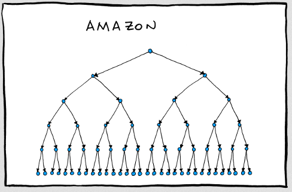
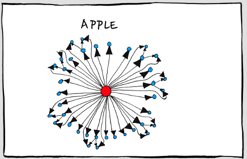
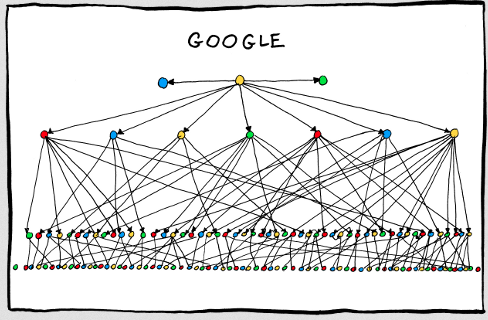
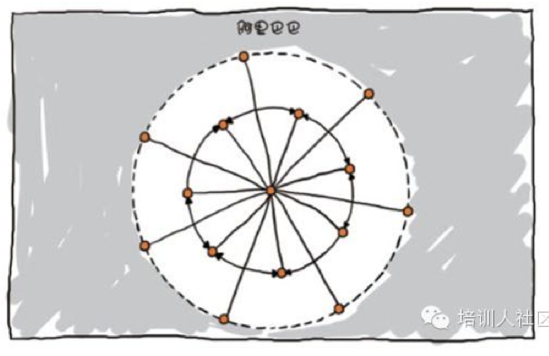
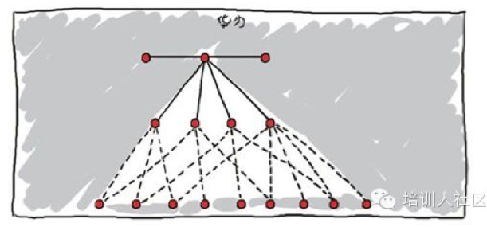
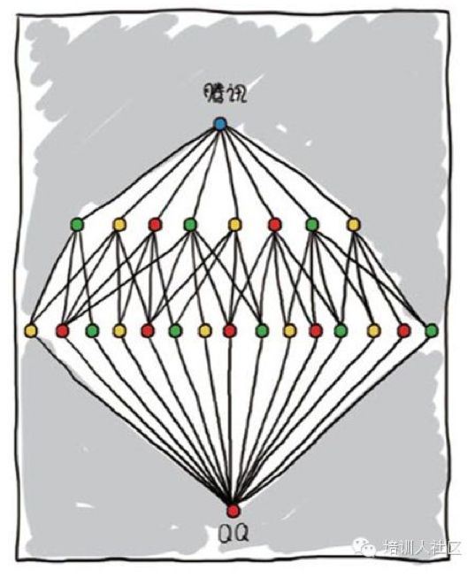
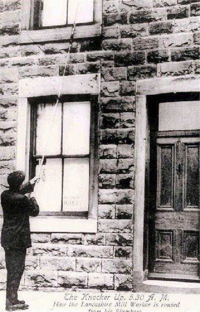
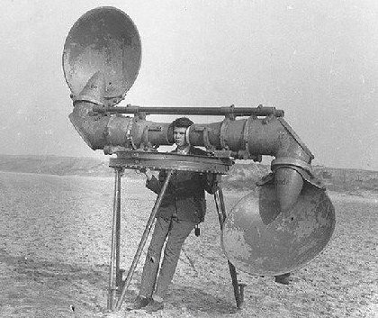

.. include:: <s5defs.txt>

==================================================================
NB\ :sup:`0`
==================================================================

～面向学生我们想提供什么... (powered by rst2S5)

:Authors: ZoomQuiet+nb[AT]gmail.com
:URL:    http://s5.zoomquiet.io/140315-nb0/

.. This document has been placed in the CC domain.
.. _Docutils: http://docutils.sourceforge.net/
.. _reStructuredText: http://docutils.sourceforge.net/rst.html
.. _S5: http://meyerweb.com/eric/tools/s5/
.. _Firefox: http://www.mozilla.com/firefox/

.. _Zoom.Quiet:
    http://code.google.com/p/openbookproject/wiki/ZoomQuiet
.. _(CC)by-nc-sa:
    http://creativecommons.org/licenses/by-nc-sa/2.5/cn/
.. _FireFox:
    http://www.mozilla.com/firefox/
.. _S5介绍:
    http://zoomquiet.org/res/s5/100826-PyTDD/s5.html
.. _WYTIWYG:
    http://wiki.woodpecker.org.cn/moin/WyTiWyG

.. 图片定义区
.. |bullet| unicode:: U+02022
.. |mode| unicode:: U+00D8 .. capital o with stroke

.. |S5icon| image:: pix/S5icon.GIF
    :align: top
    :scale: 100 %
    :target: http://www.meyerweb.com/eric/tools/s5/
.. |LeoProse| image:: pix/LeoProse.gif
    :align: top
    :scale: 100 %
    :target: http://wiki.woodpecker.org.cn/moin/LeoEnvironment
.. |cc-byncsa31| image:: i/icon/cc-byncnd-88x31.png
   :alt: (CC)by-nc-sa 许可证
   :target: http://creativecommons.org/licenses/by-nc-sa/2.5/cn/
.. |cc-byncsa15| image:: i/icon/cc-byncnd-80x15.png
   :alt: (CC)by-nc-sa 许可证
   :target: http://creativecommons.org/licenses/by-nc-sa/2.5/cn/
.. |zqeye| image:: i/id/zoomquiet_1-1_outline.png
   :alt: 是也乎;-)
   :target: http://wiki.woodpecker.org.cn/moin/ZoomQuiet

.. |lr_s5| image:: pix/levelradar_s5.png
    :scale: 100 %

.. footer:: 

   `Zoom.Quiet`_ v14.03.13 |cc-byncsa15| 推荐用 `FireFox`_ 获得最佳游览效果

<免责/>
=========

.. container:: handout

   山寨的，非业界公认的，个人体验为基础!
   |zqeye|

.. class:: takahashi1

    参考所有同好行为总结而得
        - 一切资料来自网络互动挖掘
        - 一切想法来自日常学习工作
        - 一切体悟来自各种沟通交流
        - 一切知识来自社区分享印证
        - 一切经验来自个人失败体验
    

高橋流!
=========

.. container:: handout

       `Takahashi-method 幻灯风格 <http://blog.derjohng.com/2006/04/12/takahashi-method-%E7%B0%A1%E5%A0%B1/>`__ 
       源自 Ruby 专家高橋征義(Masayoshi Takahashi)

.. class:: center

    .. image:: pix/Takahashi-method.jpg
        :height: 500px
        :alt: 高橋流
        :align: center
        :target: http://blog.derjohng.com/2006/04/12/takahashi-method-%E7%B0%A1%E5%A0%B1/

文字
=========

.. container:: handout

      `Takahashi-method 幻灯风格 <http://blog.derjohng.com/2006/04/12/takahashi-method-%E7%B0%A1%E5%A0%B1/>`__ 
      源自 Ruby 专家高橋征義(Masayoshi Takahashi)

.. class:: center takahashi9

    巨大

幻灯
=========

.. container:: handout

      `Takahashi-method 幻灯风格 <http://blog.derjohng.com/2006/04/12/takahashi-method-%E7%B0%A1%E5%A0%B1/>`__ 
      源自 Ruby 专家高橋征義(Masayoshi Takahashi)

.. class:: center takahashi9

    很多

播放
=========

.. container:: handout

      `Takahashi-method 幻灯风格 <http://blog.derjohng.com/2006/04/12/takahashi-method-%E7%B0%A1%E5%A0%B1/>`__ 
      源自 Ruby 专家高橋征義(Masayoshi Takahashi)

.. class:: center takahashi9

    :orange:`快`

播放
=========

.. container:: handout

      `Takahashi-method 幻灯风格 <http://blog.derjohng.com/2006/04/12/takahashi-method-%E7%B0%A1%E5%A0%B1/>`__ 
      源自 Ruby 专家高橋征義(Masayoshi Takahashi)

.. class:: center takahashi8

    很\ :orange:`快`\ !

播放
=========

.. container:: handout

       `Takahashi-method 幻灯风格 <http://blog.derjohng.com/2006/04/12/takahashi-method-%E7%B0%A1%E5%A0%B1/>`__ 
       源自 Ruby 专家高橋征義(Masayoshi Takahashi)

.. class:: center takahashi7

    非常\ :orange:`快`\ !

所以:
=========

.. container:: handout

      `Takahashi-method 幻灯风格 <http://blog.derjohng.com/2006/04/12/takahashi-method-%E7%B0%A1%E5%A0%B1/>`__ 
      源自 Ruby 专家高橋征義(Masayoshi Takahashi)

.. class:: center takahashi10

    听

<brief/>
=========

.. container:: handout

    |zqeye|

.. class:: takahashi

    - :orange:`3' 有关`
    - :silver:`15' 破题`
    - :silver:`15' 立命`
    - :silver:`15' 收合`
    - :silver:`35' 坐谈`

.. container:: notes

   - 

<Zoom.Quiet>
==================

.. container:: handout

   |zqeye|

.. class:: takahashi

    .. image:: i/id/100514-zq-eye.png
        :align: center
        :scale: 80 %
        :alt: 是也乎,是也乎

    .. image:: i/map/50ren-ZoomQuiet-s5-v800.png
        :align: center
        :scale: 100 %
        :alt: Zoom.Quiet
        :target: http://zoomquiet.org

.. container:: notes

   - 

有称...
==================

.. container:: handout

   ;-} |zqeye|

.. class:: takahashi8

    周导

.. container:: notes

   - 

其实...
==================

.. container:: handout

   基调是分享交流;-} |zqeye|

.. class:: takahashi8

    `大妈`__

__ http://wiki.woodpecker.org.cn/moin/ZoomQuiet

.. container:: notes

   - 

牛妞
==================

.. container:: handout

   \\ (^o^) / 596d

.. image:: i/foto/niuniu110105.jpeg
    :align: center
    :height: 700px
    :alt: 表情牛妞

.. container:: notes

   - 我的女儿刚刚一岁半,非常牛,,,脾气牛,头脑牛,虽然不会说话,但是已经能指挥我们干活了...
   - 120426-niuniu-表情帝

牛妞
==================

.. container:: handout

   \\ (^o^) / 1096d

.. image:: i/foto/120426-niuniu-表情帝.jpg
    :align: center
    :height: 700px
    :alt: 表情牛妞

.. container:: notes

   - 我的女儿刚刚一岁半,非常牛,,,脾气牛,头脑牛,虽然不会说话,但是已经能指挥我们干活了...
   - 120426-niuniu-表情帝

</Zoom.Quiet>
==================

.. container:: handout

    - 纯种Pythoner，自由软件原教旨主义者 
    - 关注社会化教育及知识管理；喜爱SF和摄影。 
    - 尝试使用Pythonic体验感化国人主动进入自由软件世界体验/学习/再创作

.. class:: takahashi8

   (^.^)

.. container:: notes

   - 

<brief/>
=========

.. container:: handout

    |zqeye|

.. class:: takahashi

    - :gray:`3' 有关`
    - :orange:`15' 破题`
    - :silver:`15' 立命`
    - :silver:`15' 收合`
    - :silver:`35' 坐谈`

.. container:: notes

   - 

今天
====================================

.. container:: handout

   |zqeye|

.. class:: takahashi8

    3.\ :orange:`15`

.. container:: notes

   - ...

学生的
====================================

.. container:: handout

   |zqeye|

.. class:: takahashi8

    质量

.. container:: notes

   - ...

Always
====================================

.. container:: handout

   |zqeye|

.. class:: takahashi8

    Na\ :orange:`ï`\ ve

.. container:: notes

   - ...

Always
====================================

.. container:: handout

   |zqeye|

.. class:: takahashi8

    不靠谱

.. container:: notes

   - ...

不靠谱
====================================

.. container:: handout

   |zqeye|

.. class:: takahashi8

    点解\ :orange:`?`

.. container:: notes

   - ...

标志
====================================

.. container:: handout

   |zqeye|

.. class:: takahashi10

    :orange:`怒`

.. container:: notes

   - ...

标志
====================================

.. container:: handout

   |zqeye|

.. class:: takahashi10

    :orange:`哀`

.. container:: notes

   - ...

标志
====================================

.. container:: handout

   |zqeye|

.. class:: takahashi10

    :orange:`燥`

.. container:: notes

   - ...

标志
====================================

.. container:: handout

   |zqeye|

.. class:: takahashi10

    :orange:`𨳒`

.. container:: notes

   - ...

标志
====================================

.. container:: handout

   |zqeye|

.. class:: takahashi10

    :orange:`妒`

.. container:: notes

   - ...

标志
====================================

.. container:: handout

   |zqeye|

.. class:: takahashi10

    :orange:`闷`

.. container:: notes

   - ...

标志
====================================

.. container:: handout

   |zqeye|

.. class:: takahashi9

    etc.

.. container:: notes

   - ...

整体上
====================================

.. container:: handout

   |zqeye|

.. class:: takahashi10

    欠

.. container:: notes

   - ...

好吧...
====================================

.. container:: handout

   |zqeye|

.. class:: takahashi8

    靠谱

.. container:: notes

   - ...

靠谱
====================================

.. container:: handout

   具体什么是,,...  |zqeye|

.. class:: takahashi

    :orange:`Kaopulity`
    

.. container:: notes

   - ...

点解 Kaopulity
====================================

.. container:: handout

   令一切流程化,并所有人可用!  |zqeye|

.. class:: incremental takahashi

    * :orange:`K` eep
    * :orange:`a` ll
    * :orange:`o` f
    * :orange:`p` rocesses
    * :orange:`u`\ sab\ :orange:`lity`
    

.. container:: notes

   - ...

所以
====================================

.. container:: handout

   |zqeye|

.. class:: takahashi10

    NB

.. container:: notes

   - ...

NB
====================================

.. container:: handout

   |zqeye|

.. class:: takahashi7

    :orange:`N`\ aïve
    
    :orange:`B`\ reaker 

.. container:: notes

   - ...

NB系列
====================================

.. container:: handout

   |zqeye|

.. class:: takahashi10

    8
    
.. container:: notes

   - ...

NB系列
====================================

.. container:: handout

   |zqeye|

.. class:: takahashi8

    NB\ :orange:`0`
    
.. container:: notes

   - ...

NB系列
====================================

.. container:: handout

   |zqeye|

.. class:: takahashi8

    NB
    
    :orange:`1~6`
    
.. container:: notes

   - ...

NB系列
====================================

.. container:: handout

   |zqeye|

.. class:: takahashi8

    开发
    
.. container:: notes

   - ...

NB系列
====================================

.. container:: handout

   |zqeye|

.. class:: takahashi8

    运维
    
.. container:: notes

   - ...

NB系列
====================================

.. container:: handout

   |zqeye|

.. class:: takahashi8

    产品
    
.. container:: notes

   - ...

NB系列
====================================

.. container:: handout

   |zqeye|

.. class:: takahashi8

    市场
    
.. container:: notes

   - ...

NB系列
====================================

.. container:: handout

   |zqeye|

.. class:: takahashi8

    设计
    
.. container:: notes

   - ...

NB系列
====================================

.. container:: handout

   |zqeye|

.. class:: takahashi8

    前端
    
.. container:: notes

   - ...

不含
====================================

.. container:: handout

   |zqeye|

.. class:: takahashi8

    C\ :orange:`*`\ O
    
.. container:: notes

   - ...

NB系列
====================================

.. container:: handout

   |zqeye|

.. class:: takahashi8

    NB\ :orange:`7`
    
.. container:: notes

   - ...

<brief/>
=========

.. container:: handout

    |zqeye|

.. class:: takahashi

    - :gray:`3' 有关`
    - :gray:`15' 破题`
    - :orange:`15' 立命`
    - :silver:`15' 收合`
    - :silver:`35' 坐谈`

.. container:: notes

   - 

公司
====================================

.. container:: handout

   |zqeye|

.. class:: takahashi8

    结构

.. container:: notes

   - ...

公司
==================

.. container:: handout

   |zqeye|

.. container:: notes

   - 

公司
==================

.. container:: handout

   |zqeye|

.. container:: notes

   - 

公司
==================

.. container:: handout

   |zqeye|

.. container:: notes

   - 

公司
==================

.. container:: handout

   |zqeye|

.. container:: notes

   - 

公司
==================

.. container:: handout

   |zqeye|

.. container:: notes

   - 

公司
==================

.. container:: handout

   |zqeye|

.. container:: notes

   - 

公司
==================

.. container:: handout

   |zqeye|

.. container:: notes

   - 

公司
====================================

.. container:: handout

   |zqeye|

.. class:: takahashi8

    :orange:`结构`

.. container:: notes

   - ...

组织结构
==================

.. container:: handout

   |zqeye|

.. class:: takahashi8

    为毛

.. container:: notes

   - 

管理
==================

.. container:: handout

   |zqeye|

.. class:: takahashi8

    边界

.. container:: notes

   - 

管理
==================

.. container:: handout

   |zqeye|

.. class:: takahashi9

    秦

.. container:: notes

   - 

秦
==================

.. container:: handout

   书同文|zqeye|

.. class:: takahashi9

    文

.. container:: notes

   - 

秦
==================

.. container:: handout

   车同轨|zqeye|

.. class:: takahashi9

    轨

.. container:: notes

   - 

秦
==================

.. container:: handout

   一法度衡石|zqeye|

.. class:: takahashi9

    衡

.. container:: notes

   - 

管理
==================

.. container:: handout

   |zqeye|

.. class:: takahashi8

    信息

.. container:: notes

   - 

机制
==================

.. container:: handout

   |zqeye|

.. class:: takahashi9

    机制
    

.. container:: notes

   - 

机制
==================

.. container:: handout

   |zqeye|

.. class:: takahashi9

    :orange:`机`\ 构
    

.. container:: notes

   - 

机制
==================

.. container:: handout

   |zqeye|

.. class:: takahashi9

    :orange:`制`\ 度
    

.. container:: notes

   - 

目的
==================

.. container:: handout

   |zqeye|

.. class:: takahashi8

    :orange:`组织`
    
    力量
    

.. container:: notes

   - 

管理信息
==================

.. container:: handout

   |zqeye|

.. class:: takahashi8

    沟通
    
    效率

.. container:: notes

   - 

什么是...
==================

.. container:: handout

   |zqeye|

.. class:: takahashi8

    职位

.. container:: notes

   - 

挖尸人
==================

.. container:: handout

   |zqeye|

.. container:: notes

   - 

人肉闹钟
==================

.. container:: handout

   |zqeye|

.. container:: notes

   - 

人肉雷达
==================

.. container:: handout

   |zqeye|

.. container:: notes

   - 

读书人
==================

.. container:: handout

   |zqeye|

.. container:: notes

   - 

现代企业
==================

.. container:: handout

   |zqeye|

.. class:: takahashi7

    职位
    
    体系

.. container:: notes

   - 

职位体系:
==================

.. container:: handout

   |zqeye|

.. class:: takahashi7

    岗位
    
    序列
    

.. container:: notes

   - 一个专业、一个职业或者一个工种

职位体系:
==================

.. container:: handout

   |zqeye|

.. class:: takahashi7

    岗位
    
    等级
    

.. container:: notes

   - 能力级别

职位体系:
==================

.. container:: handout

   |zqeye|

.. class:: takahashi8

    职衔
    

.. container:: notes

   - 名称

职位体系:
==================

.. container:: handout

   |zqeye|

.. class:: takahashi7

    职位
    
    层级
    

.. container:: notes

   - 职位名称＝岗位名称+职衔
   - 定薪

职位体系:
==================

.. container:: handout

   |zqeye|

.. class:: takahashi8

    总变
    

.. container:: notes

   - 

组织结构
==================

.. container:: handout

   |zqeye|

.. class:: takahashi8

    矩阵
    

.. container:: notes

   - 

组织结构
==================

.. container:: handout

   |zqeye|

.. class:: takahashi8

    扁平化
    

.. container:: notes

   - 

组织结构
==================

.. container:: handout

   |zqeye|

.. class:: takahashi7

    虚拟
    
    团队
    

.. container:: notes

   - 

组织结构
==================

.. container:: handout

   |zqeye|

.. class:: takahashi8

    etc.
    

.. container:: notes

   - 

组织调整
==================

.. container:: handout

   |zqeye|

.. class:: takahashi8

    应对
    

.. container:: notes

   - 

自身的应对
==================

.. container:: handout

   |zqeye|

.. class:: takahashi8

    不变
    

.. container:: notes

   - 

工作的层次
====================================

.. container:: handout

   出自 `从员工到总经理的成长笔记：自慢 <http://vip.book.sina.com.cn/book/index_72252.html>`__  |zqeye|

.. class:: takahashi

    .. class:: incremental

    - 做了
    - 做完
    - 做对
    - 做好
    - 帮他人做好!

.. container:: notes

   - ...

<brief/>
=========

.. container:: handout

    |zqeye|

.. class:: takahashi

    - :gray:`3' 有关`
    - :gray:`15' 破题`
    - :gray:`15' 立命`
    - :orange:`15' 收合`
    - :silver:`35' 坐谈`

.. container:: notes

   - 

学生
==================

.. container:: handout

   |zqeye|

.. class:: takahashi8

    :orange:`消`\ 费者
    

.. container:: notes

   - 

职员
==================

.. container:: handout

   |zqeye|

.. class:: takahashi8

    销\ :orange:`售`\ 者
    

.. container:: notes

   - 

差异
==================

.. container:: handout

   |zqeye|

.. class:: takahashi8

    巨大
    

.. container:: notes

   - 

改变
==================

.. container:: handout

   |zqeye|

.. class:: takahashi8

    如何
    

.. container:: notes

   - 

技巧
==================

.. container:: handout

   |zqeye|

.. class:: takahashi8

    知彼
    

.. container:: notes

   - 

GDG支持
==================

.. container:: handout

   |zqeye|

.. class:: takahashi9

    NB
    

.. container:: notes

   - 

技巧
==================

.. container:: handout

   |zqeye|

.. class:: takahashi8

    知己
    

.. container:: notes

   - 

技巧
==================

.. container:: handout

   |zqeye|

.. class:: takahashi8

    `提问的智慧 <http://wiki.woodpecker.org.cn/moin/AskForHelp>`_
    

.. container:: notes

   - 

不存在
==================

.. container:: handout

   |zqeye|

.. class:: takahashi8

    捷径
    

.. container:: notes

   - 

不存在捷径!
==================

.. container:: handout

   |zqeye|

.. class:: takahashi8

    莫扎特
    

.. container:: notes

   - 

不存在捷径!
==================

.. container:: handout

   4岁开始 |zqeye|

.. class:: takahashi9

    13
    

.. container:: notes

   - 

不存在捷径!
==================

.. container:: handout

   |zqeye|

.. class:: takahashi7

    Beatles
    

.. container:: notes

   - 

不存在捷径!
==================

.. container:: handout

   1957岁开始 |zqeye|

.. class:: takahashi9

    1964
    

.. container:: notes

   - 7年

所以
==================

.. container:: handout

   |zqeye|

.. class:: takahashi

    .. image:: i/s4595192.jpg
        :align: center
        :scale: 100 %
        :alt: 一万小时天才理论
        :target: http://book.douban.com/subject/4726323/

.. container:: notes

   - s4595192

不是随便一万小时的
=================================
.. container:: handout

   `生命的心流 (豆瓣) <http://book.douban.com/subject/3424068/>`_ |zqeye|

.. class:: takahashi9

    Fl\ :orange:`o`\ w
    

.. container:: notes

   - 7年

不存在捷径!
==================

.. container:: handout

   所以 |zqeye|

.. class:: takahashi9

    3年
    

.. container:: notes

   - 

不存在捷径!
==================

.. container:: handout

   |zqeye|

.. class:: takahashi9

    专注
    

.. container:: notes

   - 

专注!
==================

.. container:: handout

   |zqeye|

.. class:: takahashi10

    :orange:`一`
    

.. container:: notes

   - 

专注!
==================

.. container:: handout

   |zqeye|

.. class:: takahashi9

    哪个?
    

.. container:: notes

   - 

专注!
==================

.. container:: handout

   |zqeye|

.. class:: takahashi10

    :orange:`最`
    

.. container:: notes

   - 

<brief/>
=========

.. container:: handout

    |zqeye|

.. class:: takahashi

    - :gray:`3' 有关`
    - :gray:`15' 破题`
    - :gray:`15' 立命`
    - :gray:`15' 收合`
    - :orange:`35' 坐谈`

.. container:: notes

   - 

总之
=========

.. container:: handout

   期望可以记住的~单位时间可以记住的只有7+-2 个 |zqeye|

.. class:: incremental takahashi

    * Naive 不是错
    * 不知道就是借口
    * 专注永远是稀缺资源
    * :orange:`变态` 不费力
    * DO WAHT U'VE NEVER DONE

.. container:: notes

   - 

<discuss/>
==========

.. container:: handout

   |zqeye|

.. class:: takahashi8

    Q&A

.. class:: takahashi0

    :gray:`.` 
    
    :gray:`.`

    :Authors: ZoomQuiet+nb[AT]gmail.com
    :URL:    http://s5.zoomquiet.io/140315-nb0/

.. container:: notes

   - 

最后...
==================

.. container:: handout

   好书推荐... |zqeye|

.. class:: takahashi

    .. image:: i/s6586365-darktime.jpg
        :align: center
        :scale: 100 %
        :alt: 暗时间
        :target: http://book.douban.com/subject/6709809/

.. container:: notes

   - s4595192

最后的最后...
==================

.. container:: handout

   好书推荐... |zqeye|

.. class:: takahashi

    .. image:: i/s4279952-zen4talk.jpg
        :align: center
        :scale: 100 %
        :alt: 讲演之禅
        :target: http://book.douban.com/subject/4760725/

.. container:: notes

   - 

<版本/>
=========

.. container:: handout

   |zqeye|

- 140314 增补细节,推荐图书
- 140310 为北理珠 创建

:Authors: ZoomQuiet+nb[AT]gmail.com
:URL:    http://s5.zoomquiet.io/140315-nb0/

`S5 <http://www.meyerweb.com/eric/tools/s5/>`__
==============================================================================================

.. container:: handout

    纯HTML 幻灯撰写框架!... |S5icon| 

- S\ :sup:`5`\ == a :orange:`S` imple :orange:`S` tandards-Based :orange:`S` lide :orange:`S` how :orange:`S` ystem 

 - 仅仅依靠 CSS+JS 的HTML格式幻灯演示框架

- 我的编辑环境: |LeoProse| ~ `文学化编辑器 <http://en.wikipedia.org/wiki/Literate_programming>`__

.. image:: pix/2010-01-18-230729_605x421_leo.png
    :align: center
    :scale: 100 %
    :target: http://wiki.woodpecker.org.cn/moin/LeoEnvironment

.. container:: notes

   - 

