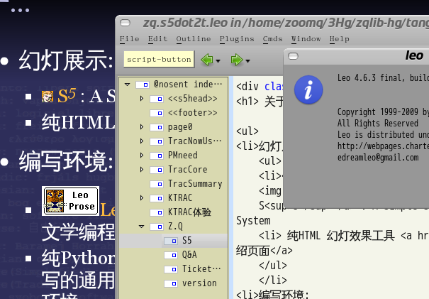

.. include:: <s5defs.txt>

==================================================================
:sup:`从`\ 游戏开始
==================================================================

～一个有关算法的虚拟故事 (powered by rst2S5)

:Authors: ZoomQuiet+gdg[AT]gmail.com
:URL:    http://s5.zoomquiet.io/140511-hoa6-start4game/

.. This document has been placed in the CC domain.
.. _Docutils: http://docutils.sourceforge.net/
.. _reStructuredText: http://docutils.sourceforge.net/rst.html
.. _S5: http://meyerweb.com/eric/tools/s5/
.. _Firefox: http://www.mozilla.com/firefox/

.. _Zoom.Quiet:
    http://code.google.com/p/openbookproject/wiki/ZoomQuiet
.. _(CC)by-nc-sa:
    http://creativecommons.org/licenses/by-nc-sa/2.5/cn/
.. _FireFox:
    http://www.mozilla.com/firefox/
.. _S5介绍:
    http://zoomquiet.org/res/s5/100826-PyTDD/s5.html
.. _WYTIWYG:
    http://wiki.woodpecker.org.cn/moin/WyTiWyG

.. 图片定义区
.. |bullet| unicode:: U+02022
.. |mode| unicode:: U+00D8 .. capital o with stroke

.. |S5icon| image:: pix/S5icon.GIF
    :align: top
    :scale: 100 %
    :target: http://www.meyerweb.com/eric/tools/s5/
.. |LeoProse| image:: pix/LeoProse.gif
    :align: top
    :scale: 100 %
    :target: http://wiki.woodpecker.org.cn/moin/LeoEnvironment
.. |cc-byncsa31| image:: i/icon/cc-byncnd-88x31.png
   :alt: (CC)by-nc-sa 许可证
   :target: http://creativecommons.org/licenses/by-nc-sa/2.5/cn/
.. |cc-byncsa15| image:: i/icon/cc-byncnd-80x15.png
   :alt: (CC)by-nc-sa 许可证
   :target: http://creativecommons.org/licenses/by-nc-sa/2.5/cn/
.. |zqeye| image:: i/id/zoomquiet_1-1_outline.png
   :alt: 是也乎;-)
   :target: http://wiki.woodpecker.org.cn/moin/ZoomQuiet

.. |lr_s5| image:: pix/levelradar_s5.png
    :scale: 100 %

.. footer:: 

   `Zoom.Quiet`_ v14.05.04 |cc-byncsa15| 推荐用 `FireFox`_ 获得最佳游览效果

<免责/>
=========

.. container:: handout

   山寨的，非业界公认的，个人体验为基础!
   |zqeye|

.. class:: takahashi1

    参考所有同好行为总结而得
        - 一切资料来自网络互动挖掘
        - 一切想法来自日常学习工作
        - 一切体悟来自各种沟通交流
        - 一切知识来自社区分享印证
        - 一切经验来自个人失败体验
    

高橋流!
=========

.. container:: handout

       `Takahashi-method 幻灯风格 <http://blog.derjohng.com/2006/04/12/takahashi-method-%E7%B0%A1%E5%A0%B1/>`__ 
       源自 Ruby 专家高橋征義(Masayoshi Takahashi)

.. class:: center

    .. image:: pix/Takahashi-method.jpg
        :height: 500px
        :alt: 高橋流
        :align: center
        :target: http://blog.derjohng.com/2006/04/12/takahashi-method-%E7%B0%A1%E5%A0%B1/

文字
=========

.. container:: handout

      `Takahashi-method 幻灯风格 <http://blog.derjohng.com/2006/04/12/takahashi-method-%E7%B0%A1%E5%A0%B1/>`__ 
      源自 Ruby 专家高橋征義(Masayoshi Takahashi)

.. class:: center takahashi9

    巨大

幻灯
=========

.. container:: handout

      `Takahashi-method 幻灯风格 <http://blog.derjohng.com/2006/04/12/takahashi-method-%E7%B0%A1%E5%A0%B1/>`__ 
      源自 Ruby 专家高橋征義(Masayoshi Takahashi)

.. class:: center takahashi9

    很多

播放
=========

.. container:: handout

      `Takahashi-method 幻灯风格 <http://blog.derjohng.com/2006/04/12/takahashi-method-%E7%B0%A1%E5%A0%B1/>`__ 
      源自 Ruby 专家高橋征義(Masayoshi Takahashi)

.. class:: center takahashi9

    :orange:`快`

播放
=========

.. container:: handout

      `Takahashi-method 幻灯风格 <http://blog.derjohng.com/2006/04/12/takahashi-method-%E7%B0%A1%E5%A0%B1/>`__ 
      源自 Ruby 专家高橋征義(Masayoshi Takahashi)

.. class:: center takahashi8

    很\ :orange:`快`\ !

播放
=========

.. container:: handout

       `Takahashi-method 幻灯风格 <http://blog.derjohng.com/2006/04/12/takahashi-method-%E7%B0%A1%E5%A0%B1/>`__ 
       源自 Ruby 专家高橋征義(Masayoshi Takahashi)

.. class:: center takahashi7

    非常\ :orange:`快`\ !

所以:
=========

.. container:: handout

      `Takahashi-method 幻灯风格 <http://blog.derjohng.com/2006/04/12/takahashi-method-%E7%B0%A1%E5%A0%B1/>`__ 
      源自 Ruby 专家高橋征義(Masayoshi Takahashi)

.. class:: center takahashi10

    听

<brief/>
=========

.. container:: handout

    |zqeye|

.. class:: takahashi

    - :orange:`3' 有关`
    - :silver:`5' 因缘`
    - :silver:`15' 次日`
    - :silver:`15' 守夜`
    - :silver:`15' 终篇`
    - :silver:`5' 检讨`
    

.. container:: notes

   - 

<Zoom.Quiet>
==================

.. container:: handout

   |zqeye|

.. class:: takahashi

    .. image:: i/id/100514-zq-eye.png
        :align: center
        :scale: 80 %
        :alt: 是也乎,是也乎

    .. image:: i/map/50ren-ZoomQuiet-s5-v800.png
        :align: center
        :scale: 100 %
        :alt: Zoom.Quiet
        :target: http://zoomquiet.org

.. container:: notes

   - 

有称...
==================

.. container:: handout

   ;-} |zqeye|

.. class:: takahashi8

    周导

.. container:: notes

   - 

其实...
==================

.. container:: handout

   基调是分享交流;-} |zqeye|

.. class:: takahashi8

    `大妈`__

__ http://wiki.woodpecker.org.cn/moin/ZoomQuiet

.. container:: notes

   - 

牛妞
==================

.. container:: handout

   \\ (^o^) / 596d

.. image:: i/foto/niuniu110105.jpeg
    :align: center
    :height: 700px
    :alt: 表情牛妞

.. container:: notes

   - 我的女儿刚刚一岁半,非常牛,,,脾气牛,头脑牛,虽然不会说话,但是已经能指挥我们干活了...
   - 120426-niuniu-表情帝

牛妞
==================

.. container:: handout

   \\ (^o^) / 1096d

.. container:: notes

   - 我的女儿刚刚一岁半,非常牛,,,脾气牛,头脑牛,虽然不会说话,但是已经能指挥我们干活了...
   - 120426-niuniu-表情帝

</Zoom.Quiet>
==================

.. container:: handout

    - 纯种Pythoner，自由软件原教旨主义者 
    - 关注社会化教育及知识管理；喜爱SF和摄影。 
    - 尝试使用Pythonic体验感化国人主动进入自由软件世界体验/学习/再创作

.. class:: takahashi8

   (^.^)

.. container:: notes

   - 

<brief/>
=========

.. container:: handout

    |zqeye|

.. class:: takahashi

    - :gray:`3' 有关`
    - :orange:`5' 因缘`
    - :silver:`15' 次日`
    - :silver:`15' 守夜`
    - :silver:`15' 终篇`
    - :silver:`5' 检讨`
    
.. container:: notes

   - 

游戏.
====================================

.. container:: handout

   |zqeye|

.. class:: takahashi

    - 把五个数字 56789, 
    - 放到 [][][] * [][], 
    - 令结果最大.
    
.. container:: notes

   - ...

当然的...
====================================

.. container:: handout

   |zqeye|

.. class:: takahashi10

    Py

.. container:: notes

   - ...

calc.py
====================================

.. container:: handout

   硬找 |zqeye|

.. sourcecode:: python
    
    for i in seq:
        product = (i[0]*100 + i[1]*10 + i[2]) * (i[3]*10 + i[4])
        if product > maximum:
           maximum = product
           max_item = i
        elif product == maximum:
           max_item += ','+i
    return max_item, maximum
    
.. container:: notes

   - ...

permute1.py
====================================

.. container:: handout

   自动生成seq |zqeye|

.. sourcecode:: python
    
    def permute(seq):
      result = []
      for a in seq:
        for b in seq:
          for c in seq:
            for d in seq:
              for e in seq:
                if a!=b and a!=c and a!=d and a!=e and \
                   b!=c and b!=d and b!=e and \
                   c!=d and c!=e and d!=e:
                  result.append(''.join([a,b,c,d,e]))
      return result
        
.. container:: notes

   - ...

结果?
====================================

.. container:: handout

   |zqeye|

.. sourcecode:: bash
    
    $ python permute1.py
    Maxmum at 87596 ,product 84000

.. container:: notes

   - ...

然后呢...
====================================

.. container:: handout

   |zqeye|

.. class:: takahashi8

    通用化

.. container:: notes

   - ...

只能...
====================================

.. container:: handout

   |zqeye|

.. class:: takahashi8

    递归

.. container:: notes

   - ...

排列
====================================

.. container:: handout

   |zqeye|

.. class:: takahashi

    - 5 个数字的排列
    - 先挑一个数, 有五种选择
    - 挑第二个数时只剩下四个选择
    - 共有 5*4*3*2*1 = 120 个排列
    
.. container:: notes

   - ...

递归函式
====================================

.. container:: handout

   |zqeye|

.. class:: takahashi

    - 先在 56789 中选出 5
    - 剩 6789 再次调用函数,
    - 得到所有以 5 为字头的排列
    - 同理,逐级求解
    - 直到要求的排列只剩下一个数
    
.. container:: notes

   - ...

permute2.py
====================================

.. container:: handout

   自动生成seq |zqeye|

.. sourcecode:: python
    
    def permute(seq):
      l = len(seq)
      if l == 1:
        return [seq]
      else:
        res=[]
        for i in range(len(seq)):
          rest = seq[:i] + seq[i+1:]
          for x in permute(rest):
            res.append(seq[i:i+1] + x)
        return res

.. container:: notes

   - ...

permute2.py
====================================

.. container:: handout

   自动生成seq |zqeye|

.. sourcecode:: python
    
    seq = list("1234")
    thelist = permute(seq)
    thelist = [ ''.join(x) for x in thelist ]
    print thelist

.. container:: notes

   - ...

permute2.py
====================================

.. container:: handout

   自动生成seq |zqeye|

.. sourcecode:: bash
    
    $ python permute2.py
    ['1234', '1243', '1324', '1342', '1423', 
    '1432', '2134', '2143', '2314', 
    '2341', '2413', '2431', '3124', 
    '3142', '3214', '3241', '3412', '3421', 
    '4123', '4132', '4213', '4231', '4312', '4321']

.. container:: notes

   - ...

但是...
====================================

.. container:: handout

   |zqeye|

.. class:: takahashi8

    能再
    
    快卟?

.. container:: notes

   - ...

发现...
====================================

.. container:: handout

   |zqeye|

.. class:: takahashi

    - 其实不必 l=1 结束
    - 因为 l=2 时
    - 排列必定是 ``[[0,1], [1,0]]``
    - 是之谓 unroll
    
.. container:: notes

   - ...

permute3.py
====================================

.. container:: handout

   自动生成seq |zqeye|

.. sourcecode:: python

    def permute(seq):
      l = len(seq)
      if l <= 2:
        if l == 2: return [ seq, [seq[1], seq[0]] ]
        else:      return [seq]
      else:
        res=[]
        for i in range(len(seq)):
          rest = seq[:i] + seq[i+1:]
          for x in permute(rest):
            res.append(seq[i:i+1] + x)
        return res
    
.. container:: notes

   - ...

calc.py
====================================

.. container:: handout

   自动生成seq |zqeye|

.. sourcecode:: python

    def calc(seq, where):
      maximum, max_item = 0, []
      for i in seq:
        product = int(i[:where]) * int(i[where:])
        if product > maximum:
           maximum, max_item = product, i
        elif product == maximum:
           max_item += ','+ i
      print "Maximum at", max_item, ",product", maximum
    
    if __name__ == "__main__":
      seq = [ "56789", "56798" ]
      where = 3
      calc(seq,where)
      
.. container:: notes

   - ...

permute3.py
====================================

.. container:: handout

   自动生成seq |zqeye|

.. sourcecode:: python

    import sys, calc
    seq = list(sys.argv[1])
    where = int(sys.argv[2])
    thelist = [ ''.join(x) for x in permute(seq) ]
    Print 'Got', len(thelist), 'items.'
    calc.calc(thelist, where)    

.. container:: notes

   - ...

permute3.py
====================================

.. container:: handout

   自动生成seq |zqeye|

.. sourcecode:: bash

    $ time python permute3.py 56789 3
    Got 120 items.
    Maximum at 87596 ,product 84000
    
    real    0m0.040s
    user    0m0.030s
    sys     0m0.010s    

.. container:: notes

   - ...

但是...
====================================

.. container:: handout

   |zqeye|

.. class:: takahashi8

    能再
    
    快卟?

.. container:: notes

   - ...

ASPN: `Getting permutation of a sequence`_
================================================
.. _Getting permutation of a sequence: http://code.activestate.com/recipes/126037-getting-nth-permutation-of-a-sequence/

.. container:: handout

   Python recipes « ActiveState Code |zqeye|

.. sourcecode:: python

    def getPerm(seq, index):
        "Returns the <index>th permutation of <seq>"
        seqc= list(seq[:])
        seqn= [seqc.pop()]
        divider= 2 # divider is meant to be len(seqn)+1, just a bit faster
        while seqc:
            index, new_index= index//divider, index%divider
            seqn.insert(new_index, seqc.pop())
            divider+= 1
        return seqn
    
    
.. container:: notes

   - ...

号称
====================================

.. container:: handout

   |zqeye|

.. class:: takahashi8

    O(n)
    
.. container:: notes

   - ...

算法时间复杂度
====================================

.. container:: handout

   表示法 |zqeye|

.. class:: takahashi

    - 大O函数指的是算法所耗时与输入规模之间的关系
    - O(n^2)代表
        - 这个算法排序n个数
        - 所耗CPU时间
        - 与n的平方在同一个数量级
    
.. container:: notes

   - ...

常见 `时间复杂度`_
====================================
.. _时间复杂度: http://zh.wikipedia.org/zh-cn/%E6%97%B6%E9%97%B4%E5%A4%8D%E6%9D%82%E5%BA%A6

.. container:: handout

   表示法 |zqeye|

.. class:: takahashi

    - 常数阶 O(1)
    - 对数阶 O(log2n)
    - 线性阶O(n)
    - 平方阶 O(n\ :sup:`2`\ )
    - 立方阶 O(n\ :sup:`3`\ )
    - ...
    
.. container:: notes

   - ...

号称
====================================

.. container:: handout

   |zqeye|

.. class:: takahashi8

    :orange:`!`
    
    O(n)
    
.. container:: notes

   - ...

test.py
====================================

.. container:: handout

   自动生成seq |zqeye|

.. sourcecode:: python

    from permute4.py import permute
    
    seq = list("1234")
    for i in range(30):
      print permute(seq, i)
      
.. container:: notes

   - ...

test.py
====================================

.. container:: handout

   自动生成seq |zqeye|

.. sourcecode:: bash

    $ python test.py
    1234 1243 1324 1423 1342 1432 2134 
    2143 3124 4123 3142 4132 2314 
    2413 3214 4213 3412 4312 2341 2431
    3241 4231 3421 4321 1234 1243 
    1324 1423 1342 1432

.. container:: notes

   - ...

permute4.py
================================================

.. container:: handout

   - Python recipes « ActiveState Code
   - `Getting permutation of a sequence`_

.. sourcecode:: python

    def getPerm(seq, index):
        seqc= list(seq[:])
        seqn= [seqc.pop()]
        divider= 2 
        while seqc:
            index, new_index= index/divider
                , index%divider
            seqn.insert(new_index, seqc.pop())
            divider+= 1
        return seqn
    
.. container:: notes

   - ...

肿么的?
====================================

.. container:: handout

   getPerm(seq, index) |zqeye|

.. class:: takahashi

    - 不同的 index 值都传回唯一的排列
    - 而且大过 n! 的 index 会从头来
    -  divider 每次都要增加一
    - 排法又是按商余数来重整
    - 一头雾水...
    
.. container:: notes

   - ...

快?!
====================================

.. container:: handout

   自动生成seq |zqeye|

.. sourcecode:: bash

    $ time cpython permute4.py 1234567 4
    Got 5040 items.
    Maximum at 6531742 ,product 4846002
    
    real    0m0.389s
    user    0m0.370s
    sys     0m0.010s
    
.. container:: notes

   - ...

但是...
====================================

.. container:: handout

   |zqeye|

.. class:: takahashi8

    睡\ :orange:`不`
    
    着!

.. container:: notes

   - ...

<brief/>
=========

.. container:: handout

    |zqeye|

.. class:: takahashi

    - :gray:`3' 有关`
    - :gray:`5' 因缘`
    - :orange:`15' 次日`
    - :silver:`15' 守夜`
    - :silver:`15' 终篇`
    - :silver:`5' 检讨`
    
.. container:: notes

   - 

Python
====================================

.. container:: handout

   |zqeye|

.. class:: takahashi3

    Slackware / RedHat / Redflag / Mandrake / Debian / XP / NT2000|3|5 / DOS / Solaris/ AIX / Unicos / OSX ...
    
.. container:: notes

   - ...

传说...
====================================

.. container:: handout

   |zqeye|

.. class:: takahashi3

    任何递归/回溯函数都
    
    可以还原成非递归的!

.. container:: notes

   - ...

求排列的方法
====================================

.. container:: handout

   |zqeye|

.. class:: takahashi

    - 5 个数取一个
    - 剩下 4 个,
    - 再取一个,
    - 剩下 3 个 .... 

.. container:: notes

   - ...

permute5.py
====================================

.. container:: handout

    |zqeye|

.. sourcecode:: python
    
    def permute(seq):
      result = []
      for i in seq:
        seq1 = seq[:] 
        seq1.remove(i)
        for j in seq1:
          seq2 = seq1[:]
          seq2.remove(j)
          for l in seq2:
            seq3 = seq2[:]
            seq3.remove(l) 
            for m in seq3:
              seq4 = seq3[:]
              seq4.remove(m)
              result.append(''.join([i,j,l,m,seq4[0]]))
      return result
      
.. container:: notes

   - ...

求排列的方法
====================================

.. container:: handout

   |zqeye|

.. class:: takahashi

    - 依次创建 5, 4, 3, 2, 1 个数的列表
    - 每个都不包括之前被选的数字
    - 然后把 5 个数合起来
    - ... 

.. container:: notes

   - ...

动态语言
====================================

.. container:: handout

   |zqeye|

.. class:: takahashi7

    自己
    
    :orange:`写`\ 自己

.. container:: notes

   - ...

permute5.py v2
====================================

.. container:: handout

    |zqeye|

.. sourcecode:: python
    
    def genfunc(n):
      head = """
    def permute(seq0):
      result = [] """
      boiler = """
    for counter%i in seq%i:
      seq%i = seq%i[:]
      seq%i.remove(counter%i)""" 
      for i in range(1,n):
        space = '  '*i
        head = head + boiler.replace('\n','\n'+space)%(i,i-1,i,i-1,i,i)
      temp = ','.join([ 'counter%i'%(x) for x in range(1,n) ] + ["seq%i[0]"%(n-1)])
      head = head + '\n' + space + "  result.append(''.join([%s]))"%(temp)
      return head + '\n  return result\n' 
      
.. container:: notes

   - ...

permute5.py v2 调用
====================================

.. container:: handout

    |zqeye|

.. sourcecode:: python
         
    import sys
    functext = genfunc(len(sys.argv[1]))
    print functext
    exec(functext)
    print dir()
    thelist = permute(list(sys.argv[1]))
    print 'Got', len(thelist), 'items.'
      
.. container:: notes

   - ...

permute5.py v2 运行
====================================

.. container:: handout

    |zqeye|

.. sourcecode:: bash

    $ python permute5.py 12345 3

    def permute(seq0):
      result = [] 
      for counter1 in seq0:
        seq1 = seq0[:]
        seq1.remove(counter1)
        for counter2 in seq1:
          seq2 = seq1[:]
          seq2.remove(counter2)
          for counter3 in seq2:
            seq3 = seq2[:]
            seq3.remove(counter3)
            for counter4 in seq3:
              seq4 = seq3[:]
              seq4.remove(counter4)
              result.append(''.join([counter1,counter2,counter3,counter4,seq4[0]]))
      return result
    
    ['__builtins__', '__doc__', '__name__', 'calc', 'functext', 'genfunc', 
    'permute', 'sys']
    Got 120 items.

.. container:: notes

   - ...

permute5.py v2 输出
====================================

.. container:: handout

    |zqeye|

.. sourcecode:: bash
    
    ...
              result.append(''.join([counter1,counter2,counter3,counter4,seq4[0]]))
      return result
    
    ['__builtins__', '__doc__', '__name__', 'calc', 'functext', 'genfunc', 
    'permute', 'sys']
    Got 120 items.

.. container:: notes

   - ...

permute5.py v2 计时
====================================

.. container:: handout

    |zqeye|

.. sourcecode:: python
    
    ...
    import sys, calc
    functext = genfunc(len(sys.argv[1]))
    #print functext
    exec(functext)
    thelist = permute(list(sys.argv[1]))
    print 'Got',len(thelist),'items.'
    calc.calc(thelist,int(sys.argv[2]))

.. container:: notes

   - ...

permute5.py v2 time 
====================================

.. container:: handout

    |zqeye|

.. sourcecode:: bash
    
    $ time cpython permute5.py 1234567 4
    Got 5040 items.
    Maximum at 6531742 ,product 4846002
    
    real    0m0.213s
    user    0m0.200s
    sys     0m0.010s

.. container:: notes

   - ...

 

等等...
==================

.. container:: handout

   |zqeye|

.. class:: takahashi8

    也许
    

.. container:: notes

   - 

数学...
==================

.. container:: handout

   |zqeye|

.. class:: takahashi8

    课本
    

.. container:: notes

   - 

排列组合原理
====================================

.. container:: handout

    |zqeye|

::

                          [4321]  
                          [3421]
                 [321]  < [3241]     
          [21] < [231]... [3214]
                 [213]...
    [1] <
                 [321]...
          [21] < [231]...
                 [213]...      
    
.. container:: notes

   - ...

求排列的方法
====================================

.. container:: handout

   |zqeye|

.. class:: incremental takahashi

    - 先选一个数 1
    - 然后第二个数 2 
    - 可以放在 1 的前面或是后面
    - 而每一个放法都会产生一个 2 位数
    - 对於每一个这样的两位数

.. container:: notes

   - ...

求排列的方法
====================================

.. container:: handout

   |zqeye|

.. class:: incremental takahashi

    - 第三个数 3, 都可以放在它的前面, 中间, 或是最后
    - 而每一个 3 位数
    - 第 4 位数都可以插入到这 3 个数的任何一个空位中
    - 如此类推...

.. container:: notes

   - ...

permute6.py
====================================

.. container:: handout

    |zqeye|

.. sourcecode:: python
    
    def permute(seq):
      seqn = [seq.pop()]
      while seq:
        newseq = []
        new = seq.pop()
        #print "seq:",seq,'seqn', seqn ,'new', new
        for i in range(len(seqn)):
          item = seqn[i]
          for j in range(len(item)+1):
            newseq.append(''.join([item[:j]
                , new
                , item[j:]]))
        seqn = newseq
        #print 'newseq',newseq
      return  seqn
    
.. container:: notes

   - ...

permute6.py 调用
====================================

.. container:: handout

    |zqeye|

.. sourcecode:: python
    
    import sys, calc
    seq = list(sys.argv[1])
    where = int(sys.argv[2])
    thelist = permute(seq)
    print 'Got', len(thelist), 'items.'
    calc.calc(thelist, where)
    

.. container:: notes

   - ...

permute6.py 运行
====================================

.. container:: handout

    |zqeye|

.. sourcecode:: bash
    
    $ time cpython permute6.py 1234567 4
    Got 5040 items.
    Maximum at 6531742 ,product 4846002
    
    real    0m0.167s
    user    0m0.150s
    sys     0m0.020s
    

.. container:: notes

   - ...

但是...
====================================

.. container:: handout

   |zqeye|

.. class:: takahashi8

    能再
    
    快卟?

.. container:: notes

   - ...

<brief/>
=========

.. container:: handout

    |zqeye|

.. class:: takahashi

    - :gray:`3' 有关`
    - :gray:`5' 因缘`
    - :gray:`15' 次日`
    - :orange:`15' 守夜`
    - :silver:`15' 终篇`
    - :silver:`5' 检讨`

.. container:: notes

   - 

permute6.py 结果
====================================

.. container:: handout

    |zqeye|

.. sourcecode:: bash
    
    Got 24 items.
    [
    '1234', '2134', '2314', '2341', 
    '1324', '3124', '3214', '3241', 
    '1342', '3142', '3412', '3421', 
    '1243', '2143', '2413', '2431', 
    '1423', '4123', '4213', '4231', 
    '1432', '4132', '4312', '4321'
    ]

.. container:: notes

   - ...

目测...
====================================

.. container:: handout

   |zqeye|

.. class:: takahashi8

    对称!

.. container:: notes

   - ...

permute7.py
====================================

.. container:: handout

    |zqeye|

.. sourcecode:: python
    
    def permute(seq):
      seqn = [ seq.pop()+seq.pop() ] # 仅改此处
      while seq:
        newseq = []
        new = seq.pop()
        #print "seq:",seq,'seqn', seqn ,'new', new
        for i in range(len(seqn)):
          item = seqn[i]
          for j in range(len(item)+1):
            newseq.append(''.join([item[:j]
                , new
                , item[j:]]))
        seqn = newseq
        #print 'newseq',newseq
      return  seqn
    
.. container:: notes

   - ...

求排列的方法
====================================

.. container:: handout

   |zqeye|

.. class:: incremental takahashi

    - 但是要得到整个排列的话
    - 重抄一次而且每个元素都要反过来
    - "1234" -> "4321"
    - 字串并没有反序的函数
    - 只能 `list.reverse()`
    - 但是...

.. container:: notes

   - ...

calc2.py
====================================

.. container:: handout

    |zqeye|

.. sourcecode:: python
    
    def calc2(seq, where):
      maximum, max_item = 0, []
      for i in seq:
        product = int(i[:where]) * int(i[where:])
        if product > maximum:
           maximum, max_item = product, i
        elif product == maximum:
           max_item += ','+i
        rev = list(i)
        rev.reverse() # 专门配合permute7.py
        i = ''.join(rev)
        product = int(i[:where]) * int(i[where:])
        if product > maximum:
           maximum, max_item = product, i
        elif product == maximum:
           max_item += ','+i
      print "Maximum at", max_item, ",product", maximum
    
.. container:: notes

   - ...

permute.py v2~7 对比
====================================

.. container:: handout

    |zqeye|

.. sourcecode:: bash
    
    $ time python permute2.py 123456789 5
    Got 362880 items.
    Maximum at 875319642 ,product 843973902
    
    real    0m46.478s
    user    0m46.020s
    sys     0m0.430s

.. container:: notes

   - ...

permute.py v1~7 对比
====================================

.. container:: handout

    |zqeye|

.. sourcecode:: bash
    
    $ time python permute3.py 123456789 5
    Got 362880 items.
    Maximum at 875319642 ,product 843973902
    
    real    0m38.997s
    user    0m38.600s
    sys     0m0.400s

.. container:: notes

   - ...

permute.py v1~7 对比
====================================

.. container:: handout

    |zqeye|

.. sourcecode:: bash
    
    $ time python permute4.py 123456789 5
    Got 362880 items.
    Maximum at 875319642 ,product 843973902
    
    real    0m33.845s
    user    0m33.460s
    sys     0m0.380s
    
.. container:: notes

   - ...

permute.py v1~7 对比
====================================

.. container:: handout

    |zqeye|

.. sourcecode:: bash
    
    $ time python permute5.py 123456789 5
    Got 362880 items.
    Maximum at 875319642 ,product 843973902
    
    real    0m10.681s
    user    0m10.530s
    sys     0m0.150s
    
.. container:: notes

   - ...

permute.py v1~7 对比
====================================

.. container:: handout

    |zqeye|

.. sourcecode:: bash
    
    $ time python permute6.py 123456789 5
    Got 362880 items.
    Maximum at 875319642 ,product 843973902
    
    real    0m8.279s
    user    0m8.110s
    sys     0m0.170s    
    
.. container:: notes

   - ...

permute.py v1~7 对比
====================================

.. container:: handout

    |zqeye|

.. sourcecode:: bash
    
    $ time cpython permute7.py 123456789 5
    Got 181440 items.
    Maximum at 875319642 ,product 843973902
    
    real    0m7.827s
    user    0m7.650s
    sys     0m0.180s    
    
.. container:: notes

   - ...

7倍!
====================================

.. container:: handout

   |zqeye|

.. class:: incremental takahashi

    - permute2.py: user    0m46.020s
    - permute7.py: user    0m7.650s
    - 哈哈哈!
    - 近七倍呢...

.. container:: notes

   - ...

但是...
====================================

.. container:: handout

   |zqeye|

.. class:: takahashi8

    睡\ :orange:`不`
    
    着!

.. container:: notes

   - ...

排列组合原理
====================================

.. container:: handout

    |zqeye|

::

                          [4321]  
                          [3421]
                 [321]  < [3241]     
          [21] < [231]... [3214]
                 [213]...
    [1] <
                 [321]...
          [21] < [231]...
                 [213]...      
    
.. container:: notes

   - ...

求排列的方法
====================================

.. container:: handout

   |zqeye|

.. class:: incremental takahashi

    - 设想有 n 个数字
    - 先取第一个数字
    - 再取第二个数字
    - 第二个数可以放在第一个数的左或右面
    - 就是有 0, 1 两个选择
    - ...

.. container:: notes

   - ...

求排列的方法
====================================

.. container:: handout

   |zqeye|

.. class:: incremental takahashi

    - 再取第三个数,
    - 可放在最左, 中间, 最右
    - 就是有 0, 1, 2 三个选择
    - 嗯嗯嗯?
    - 八进位那些数系转换关系?!

.. container:: notes

   - ...

94介样
====================================

.. container:: handout

   |zqeye|

.. class:: takahashi8

    没错

.. container:: notes

   - ...

求排列的方法
====================================

.. container:: handout

   |zqeye|

.. class:: incremental takahashi

    - 若求 4个数的 4! = 24 个排列,
    - 第 18 个排列可以这样求得
    - 18 除 2, 余数是 0,
    - 所以第二个数放在第一个数的左面
    - 

.. container:: notes

   - ...

求排列的方法
====================================

.. container:: handout

   |zqeye|

.. class:: incremental takahashi

    - 然后商 9 再除 3,
    - 余数 0, 所以第三个数於在头两个数的最左
    - 最后 3 除以 4, 余数是 3
    - 因此第四个数要放在前三个数的第 4 个空位
    - 也就是最右面!

.. container:: notes

   - ...

最大好处...
====================================

.. container:: handout

   原子化 |zqeye|

.. class:: takahashi8

    分布式

.. container:: notes

   - ...

这不94..
====================================

.. container:: handout

   原子化 |zqeye|

.. class:: takahashi8

    等等?!

.. container:: notes

   - ...

permute4.py
================================================

.. container:: handout

   - Python recipes « ActiveState Code
   - `Getting permutation of a sequence`_

.. sourcecode:: python

    def getPerm(seq, index):
        seqc= list(seq[:])
        seqn= [seqc.pop()]
        divider= 2 
        while seqc:
            index, new_index= index/divider
                , index%divider
            seqn.insert(new_index, seqc.pop())
            divider+= 1
        return seqn
    
.. container:: notes

   - ...

世上聪明人太多..
====================================

.. container:: handout

    |zqeye|

.. class:: takahashi8

    残念

.. container:: notes

   - ...

<brief/>
=========

.. container:: handout

    |zqeye|

.. class:: takahashi

    - :gray:`3' 有关`
    - :gray:`5' 因缘`
    - :gray:`15' 次日`
    - :gray:`15' 守夜`
    - :orange:`15' 终篇`
    - :silver:`5' 检讨`

.. container:: notes

   - 

梦...
==================

.. container:: handout

   |zqeye|

.. class:: takahashi

    .. image:: i/snap/阿凡提.jpg
        :align: center
        :height: 400px
        :alt: 讲演之禅
        :target: http://book.douban.com/subject/4760725/

.. container:: notes

   - 

提出挑战
====================================

.. container:: handout

   |zqeye|

.. class:: incremental takahashi

    - 除非你解答了我的难题,
    - 不然我的驴子会不停在你耳边嘶叫令你无法睡好!
    - 问题是: 
    - ...

.. container:: notes

   - ...

游戏.
====================================

.. container:: handout

   |zqeye|

.. class:: takahashi

    - 把五个数字 56789, 
    - 放到 [][][] * [][], 
    - 令结果最大.
    
.. container:: notes

   - ...

阿凡提没电脑...
====================================

.. container:: handout

   |zqeye|

.. class:: takahashi8

    等等!

.. container:: notes

   - ...

数学推理
====================================

.. container:: handout

    |zqeye|

.. sourcecode:: python
    
    # 假设五个数为  [a][b][c]*[d][e]
    # 展开的话...
    
      a * 100 * d * 10
    + a * 100 * e * 1
    + b * 10  * d * 10
    + b * 10  * e * 1
    + c * 1   * d * 10 
    + c * 1   * e * 1

.. container:: notes

   - ...

矩阵
====================================

.. container:: handout

    |zqeye|

.. sourcecode:: python
        
    # 这个可以写成一个矩阵
    
          d    e
    a  1000  100
    b   100   10
    c    10    1

.. container:: notes

   - ...

数值推理
====================================

.. container:: handout

   |zqeye|

.. class:: incremental takahashi

    - a 带来的贡献是:
    - 一个百位数加上一个十位数
    - b 的贡献是:
    - 一个百位数加十位数加个位数
    - 因此 d 要比 a 更重要
    - 要取得最大的积,一定要最大放在 d 的位置

.. container:: notes

   - ...

对数矩阵
====================================

.. container:: handout

    |zqeye|

.. sourcecode:: python
        
          d    e
    a  1000  100
    b   100   10
    c    10    1

    # 用对数来记数
    # 100 = 10e2, 用 2 来代表好了
    
       d e 
    a  3 2
    b  2 1
    c  1 0

.. container:: notes

   - ...

数值推理
====================================

.. container:: handout

   |zqeye|

.. class:: incremental takahashi

    - 计算每一行或列的和
    - 称为该数位的贡献基值,
    - 因此...

.. container:: notes

   - ...

对数矩阵
====================================

.. container:: handout

    |zqeye|

.. sourcecode:: python
        
       d e 
    a  3 2
    b  2 1
    c  1 0
    
    # 贡献基数
        a = 5
        b = 3
        c = 1
        d = 6
        e = 3

.. container:: notes

   - ...

数值推理
====================================

.. container:: handout

   |zqeye|

.. class:: incremental takahashi

    - 因为我们用了对数,
    - 而 log(1) = 0,
    - 因此把 b 和 e 之间的微小分别给忽略了
    - 所以...
    - 把每个数都 +1

.. container:: notes

   - ...

对数矩阵
====================================

.. container:: handout

    |zqeye|

.. sourcecode:: python
        
       d e
    a  4 3
    b  3 2
    c  2 1
    
    # 贡献基数
        a = 7
        b = 5
        c = 3
        d = 9
        e = 6

.. container:: notes

   - ...

数值推理~错?
====================================

.. container:: handout

   |zqeye|

.. class:: incremental takahashi

    - 这些基数代表了该位置的重要性,
    - 可以按大小分予不同的数字;
    - 所以: 865 * 97
    - 但是...
    - 正确解是 875 * 96

.. container:: notes

   - ...

数值推理
====================================

.. container:: handout

   |zqeye|

.. class:: incremental takahashi

    - b 的页献: b * d * 100 + b * e * 10 
    - e 的页献: e * a * 100 + e * b * 10 + e * c 
    - 但因为我们把 9 配给了 d 而 8 配给了 a
    - 基数只相差在 e * c 这个个位数乘积上
    - 结果把这个小的差异覆盖掉了

.. container:: notes

   - ...

二阶基数
====================================

.. container:: handout

   |zqeye|

.. class:: incremental takahashi

    - 如 b * d 的基数是 100
    - 但是由於 d 的基数为 9, 
    - 那 b 的二阶基数可以算成 9,
    - 代表和 b 相关的是一个较为重要的数,
    - ...

.. container:: notes

   - ...

二阶基数
====================================

.. container:: handout

   |zqeye|

.. class:: incremental takahashi

    - 同样 e * a 的基数是也是 100 
    - 但由於 a 的基数只是 7
    - 因此 e 的二阶基数只是 7 而已
    - 这样就可以得出 b 要比 e 更重要!

.. container:: notes

   - ...

三阶基数
====================================

.. container:: handout

   |zqeye|

.. class:: incremental takahashi

    - 其实 b 和 e 的二阶基数
    - 原来也是一样的 :orange:`!`
    - 大家都是 15
    - 也许要上三阶基数?

.. container:: notes

   - ...

但是...
====================================

.. container:: handout

   |zqeye|

.. class:: takahashi8

    :orange:`不`
    
    妥当

.. container:: notes

   - ...

半个...
====================================

.. container:: handout

   |zqeye|

.. class:: takahashi8

    :orange:`凉`
    
    馒头

.. container:: notes

   - ...

答案进入脑海
====================================

.. container:: handout

   |zqeye|

.. class:: incremental takahashi

    - 求出所有位置的"重要性"
    - 依次把最大的数字分配给最重要的位置
    - 但是,位置是\ :orange:`纠缠` 的!
    - 因此,一次算出所有位置的 "重要性"
    - 不现实!

.. container:: notes

   - ...

每次只求一个位置!
====================================

.. container:: handout

   |zqeye|

.. class:: incremental takahashi

    - 目标形式 abcd*de
    - 假如 5 个数字一样, 11111,
    - 最大的乘积只能是 111 * 11
    - 改哪个会使结果最大?
    - 答案是 111 * 21
    - 也就是 d 的位置. 好, 把 d 替换成 9

.. container:: notes

   - ...

每次只求一个位置!
====================================

.. container:: handout

   |zqeye|

.. class:: incremental takahashi

    - 问题变成 5 个数字, 111 * 91
    - 改一个数(除了 9), 改哪一个 ?
    - 211 * 91, 121 * 91, 112 * 91, 111 * 19
    - 答案是 211 * 91
    - 答案是 111 * 21
    - 也就是 a 的位置. 好, 替换成 8. 
    - 以此类推..

.. container:: notes

   - ...

wise.py
================================================

.. container:: handout

   基于阿凡提的 wise |zqeye|

.. sourcecode:: python

    def solve(seq,where):
      n = len(seq)
      seq.sort()
      seq.reverse()
      table = [ [] for i in range(n) ]
      left, right = where, n - where
      leftr = long('1'*left) # 全1 的占位数值
      rightr = long('1'*right)
      flag=[] # 已经选好的位置
      for item in [ int(x) for x in seq]:
        for i in range(left):
          table[left-i-1] = (leftr + 10**i) * rightr      
        for i in range(right):
          table[right-i+where-1] = leftr * (rightr + 10**i)

.. container:: notes

   - ...

wise.py
================================================

.. container:: handout

   基于阿凡提的 wise |zqeye|

.. sourcecode:: python

        for i in flag:
          table[i] = 0
        tablesorted = table[:]
        tablesorted.sort()
        maxindex = table.index(tablesorted[-1])
        if maxindex >= where:
           rightr = rightr + (item-1) * 10**(right-maxindex+where-1)
        else:
           leftr = leftr + (item-1) * 10**(left-maxindex-1)
        flag.append(maxindex)
        #print maxindex, leftr, rightr
      return leftr, rightr
      
.. container:: notes

   - ...

对比
====================================

.. container:: handout

    |zqeye|

.. sourcecode:: bash
    
    $time python permute7.py 123456789 5
    Got 181440 items.
    Maximum at 875319642 ,product 843973902
    
    real    0m7.827s
    user    0m7.650s
    sys     0m0.180s
    
    $ time python wise2.py 123456789 5
    Maximum at 87531 9642 ,product 843973902
    
    real    0m0.042s
    user    0m0.010s
    sys     0m0.030s
    
.. container:: notes

   - ...

Wow
====================================

.. container:: handout

   |zqeye|

.. class:: takahashi7

    两百
    
    倍\ :orange:`!`

.. container:: notes

   - ...

跳出限制
====================================

.. container:: handout

   不用阶乘|zqeye|

.. class:: takahashi8

    n\ :orange:`!`

.. container:: notes

   - ...

这种感觉
====================================

.. container:: handout

   |zqeye|

.. class:: takahashi8

    to
    
    :orange:`hack`

.. container:: notes

   - ...

<brief/>
=========

.. container:: handout

    |zqeye|

.. class:: takahashi

    - :gray:`3' 有关`
    - :gray:`5' 因缘`
    - :gray:`15' 次日`
    - :gray:`15' 守夜`
    - :gray:`15' 终篇`
    - :orange:`5' 检讨`

.. container:: notes

   - 

glace的自省
====================================

.. container:: handout

   - CPU: Pentium III 866 RAM: 128 MB 
   - Slackware Linux: 9.0 Linux Kernel: 2.4.2 GCC: 3.2.2
   - Python: 修改过的 2.1.3 

.. class:: incremental takahashi

    - 问题要规范成普遍形式
    - 先自行尝试,再找更好的
    - 然后,想另一个打败之
    - 教科书/Python 是好的
    - 啃凉馒头对脑筋有帮助

.. container:: notes

   - ...

总之
=========

.. container:: handout

   期望可以记住的~单位时间可以记住的只有7+-2 个 |zqeye|

.. class:: incremental takahashi

    * #NoZuoNoDieWhyUtry#
    * 专注总是稀缺资源
    * 兴趣是坚持的动力
    * 有趣是最好的奖励
    * DO WAHT U'VE NEVER DONE

.. container:: notes

   - 

<discuss/>
==========

.. container:: handout

   |zqeye|

.. class:: takahashi8

    Q&A

.. class:: takahashi0

    :gray:`.` 
    
    :gray:`.`

    :Authors: ZoomQuiet+gdg[AT]gmail.com
    :URL:    http://s5.zoomquiet.io/140511-hoa6-start4game/

.. container:: notes

   - 

最后的最后...
==================

.. container:: handout

   好书推荐... |zqeye|

.. class:: takahashi

    .. image:: i/s4279952-zen4talk.jpg
        :align: center
        :height: 400px
        :alt: 讲演之禅
        :target: http://book.douban.com/subject/4760725/

.. container:: notes

   - 

<版本/>
=========

.. container:: handout

   |zqeye|

- 140508 调整细节,形成故事...
- 140507 增补代码,调节章节
- 140504 为HOA.6 创建
- 050319 珍藏到 啄木鸟Wiki 中
    - http://wiki.woodpecker.org.cn/moin/AllStartFromGame
- 2002年许由 glace 整理到中蟒 Wiki 中

:Authors: ZoomQuiet+gdg[AT]gmail.com
:URL:    http://s5.zoomquiet.io/140511-hoa6-start4game/

`S5 <http://www.meyerweb.com/eric/tools/s5/>`__
==============================================================================================

.. container:: handout

    纯HTML 幻灯撰写框架!... |S5icon| 

- S\ :sup:`5`\ == a :orange:`S` imple :orange:`S` tandards-Based :orange:`S` lide :orange:`S` how :orange:`S` ystem 

 - 仅仅依靠 CSS+JS 的HTML格式幻灯演示框架

- 我的编辑环境: |LeoProse| ~ `文学化编辑器 <http://en.wikipedia.org/wiki/Literate_programming>`__

.. container:: notes

   - 

